# IPv4 & IPv6 - Internet Protocol Addressing and Routing

## Definition

IPv4 (Internet Protocol version 4) and IPv6 (Internet Protocol version 6) are the fundamental protocols that enable communication across the internet by providing unique addressing schemes and routing mechanisms. IPv4 uses 32-bit addresses allowing for ~4.3 billion unique addresses, while IPv6 uses 128-bit addresses providing virtually unlimited address space.

IPv4 addresses are written in dotted decimal notation (e.g., 192.168.1.1), while IPv6 addresses use hexadecimal notation separated by colons (e.g., 2001:db8::1). Both protocols handle packet forwarding, fragmentation, and basic error detection at the network layer.

## Core RFC References

- **RFC 791** - Internet Protocol (IPv4) specification
- **RFC 8200** - Internet Protocol, Version 6 (IPv6) specification  
- **RFC 4291** - IPv6 Addressing Architecture
- **RFC 1918** - Address Allocation for Private Internets (IPv4)

## Why It Matters

IP protocols form the foundation of all internet communication. Every device connected to the internet requires an IP address to send and receive data. Understanding IP addressing is crucial for:

- **Network Design**: Subnetting, CIDR blocks, and address planning
- **Security**: Firewall rules, access control, and network segmentation
- **Troubleshooting**: Routing issues, connectivity problems, and performance optimization
- **Scalability**: IPv6 adoption for IoT and mobile device proliferation

## Real World Scenario for Engineers

**Scenario**: Designing a microservices architecture for a global e-commerce platform

You're architecting a system with 50+ microservices across multiple AWS regions. Each service needs:
- **IPv4 private addressing** for internal communication (RFC 1918: 10.0.0.0/8, 172.16.0.0/12, 192.168.0.0/16)
- **IPv6 addressing** for mobile app traffic (growing mobile user base requires IPv6)
- **Load balancer IP allocation** across availability zones
- **Container networking** with overlay networks (Docker/Kubernetes)

**Engineering Decisions**:
- Use `/16` CIDR blocks per region (65,534 addresses each)
- Implement dual-stack (IPv4/IPv6) for future-proofing
- Reserve IP ranges for auto-scaling groups
- Plan for service mesh communication patterns

## Mermaid Diagram

```mermaid
graph TB
    subgraph "IPv4 Packet Structure"
        A[Version: 4] --> B[Header Length: 5-15]
        B --> C[Type of Service: 8 bits]
        C --> D[Total Length: 16 bits]
        D --> E[Identification: 16 bits]
        E --> F[Flags: 3 bits]
        F --> G[Fragment Offset: 13 bits]
        G --> H[TTL: 8 bits]
        H --> I[Protocol: 8 bits]
        I --> J[Header Checksum: 16 bits]
        J --> K[Source IP: 32 bits]
        K --> L[Destination IP: 32 bits]
        L --> M[Options: Variable]
        M --> N[Data Payload]
    end
    
    subgraph "IPv6 Packet Structure"
        O[Version: 4] --> P[Traffic Class: 8 bits]
        P --> Q[Flow Label: 20 bits]
        Q --> R[Payload Length: 16 bits]
        R --> S[Next Header: 8 bits]
        S --> T[Hop Limit: 8 bits]
        T --> U[Source IP: 128 bits]
        U --> V[Destination IP: 128 bits]
        V --> W[Data Payload]
    end
    
    subgraph "Address Comparison"
        X[IPv4: 192.168.1.1<br/>32 bits<br/>4.3B addresses] 
        Y[IPv6: 2001:db8::1<br/>128 bits<br/>340 undecillion addresses]
    end
    
    subgraph "Routing Process"
        Z[Packet Arrives] --> AA{Check Destination}
        AA -->|Local Network| BB[Direct Delivery]
        AA -->|Remote Network| CC[Forward to Gateway]
        CC --> DD[Route Table Lookup]
        DD --> EE[Next Hop Selection]
        EE --> FF[Packet Forwarded]
    end
```

