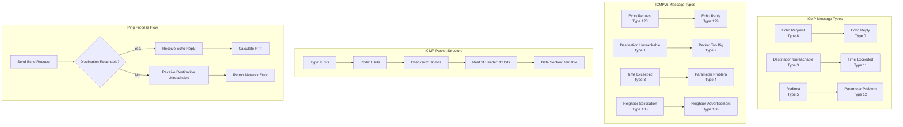

# ICMP / ICMPv6 - Internet Control Message Protocol

## Definition

ICMP (Internet Control Message Protocol) and ICMPv6 are network layer protocols used for error reporting and diagnostic functions in IP networks. ICMP operates over IPv4 while ICMPv6 is the corresponding protocol for IPv6. These protocols enable network devices to communicate error conditions and operational information that cannot be conveyed through normal data transmission.

ICMP messages are encapsulated within IP packets and include various message types such as Echo Request/Reply (ping), Destination Unreachable, Time Exceeded, and Redirect messages. ICMPv6 extends these capabilities with additional functionality for IPv6 including Neighbor Discovery and Path MTU Discovery.

## Core RFC References

- **RFC 792** - Internet Control Message Protocol (ICMP) for IPv4
- **RFC 4443** - Internet Control Message Protocol (ICMPv6) for IPv6
- **RFC 4861** - Neighbor Discovery for IP version 6 (ICMPv6-based)
- **RFC 4884** - Extended ICMP to Support Multi-Part Messages

## Why It Matters

ICMP/ICMPv6 protocols are essential for network diagnostics, troubleshooting, and proper network operation:

- **Network Diagnostics**: Tools like ping and traceroute rely on ICMP for connectivity testing
- **Error Reporting**: Routers use ICMP to report unreachable destinations and routing issues
- **Path Discovery**: ICMPv6 enables automatic network configuration and neighbor discovery
- **Performance Monitoring**: Network administrators use ICMP for latency measurement and health checks

## Real World Scenario for Engineers

**Scenario**: Monitoring microservices health in a Kubernetes cluster

You're managing a distributed system with 100+ microservices across multiple nodes. Each service needs health monitoring and network diagnostics:

- **Health Checks**: Kubernetes liveness/readiness probes use ICMP ping to verify pod connectivity
- **Network Troubleshooting**: When services can't communicate, ICMP helps identify network partitions
- **Load Balancer Monitoring**: ICMP echo requests verify backend server availability
- **Cross-Region Latency**: ICMP timestamps measure network performance between data centers

**Engineering Decisions**:
- Implement ICMP-based health checks with sub-second timeouts
- Use traceroute (ICMP Time Exceeded) for network path analysis
- Configure firewall rules to allow ICMP for monitoring while blocking malicious traffic
- Set up automated alerts based on ICMP response times and packet loss

## Mermaid Diagram

