# TCP - Transmission Control Protocol

## Definition

TCP (Transmission Control Protocol) is a connection-oriented, reliable transport layer protocol that provides ordered, error-checked delivery of data between applications. TCP establishes a virtual connection between sender and receiver through a three-way handshake, maintains connection state, and ensures data integrity through sequence numbers, acknowledgments, and retransmission mechanisms.

TCP handles flow control through sliding window protocols, congestion control through algorithms like slow start and congestion avoidance, and provides full-duplex communication. It segments application data into packets, reassembles them at the destination, and handles packet loss, duplication, and reordering automatically.

## Core RFC References

- **RFC 9293** - Transmission Control Protocol (TCP) specification (latest)
- **RFC 793** - Original TCP specification
- **RFC 5681** - TCP Congestion Control
- **RFC 7323** - TCP Extensions for High Performance

## Why It Matters

TCP is the foundation of reliable internet communication, powering most web applications and services:

- **Web Traffic**: HTTP/HTTPS relies on TCP for reliable web page delivery
- **Application Protocols**: Email (SMTP), file transfer (FTP), remote access (SSH) use TCP
- **Database Connections**: SQL databases require TCP's reliability for ACID transactions
- **API Communication**: REST APIs and microservices depend on TCP's ordered delivery

## Real World Scenario for Engineers

**Scenario**: Building a high-throughput trading platform with microsecond latency requirements

You're designing a financial trading system handling 100,000+ transactions per second across global markets:

- **Connection Pooling**: Maintain persistent TCP connections to exchanges to avoid handshake overhead
- **TCP Tuning**: Optimize window sizes, disable Nagle's algorithm for low latency
- **Congestion Control**: Use BBR or CUBIC algorithms for high-bandwidth, low-latency networks
- **Load Balancing**: Implement TCP connection multiplexing across multiple servers

**Engineering Decisions**:
- Use TCP_NODELAY to disable Nagle's algorithm for real-time data
- Configure large TCP buffers (several MB) for high-throughput connections
- Implement connection keep-alive to detect failed connections quickly
- Monitor TCP retransmission rates and RTT for performance optimization

## Mermaid Diagram

```mermaid
graph TB
    subgraph "TCP Three-Way Handshake"
        A[Client] -->|1. SYN seq=x| B[Server]
        B -->|2. SYN-ACK seq=y, ack=x+1| A
        A -->|3. ACK seq=x+1, ack=y+1| B
        B --> C[Connection Established]
    end
    
    subgraph "TCP Header Structure"
        D[Source Port: 16 bits] --> E[Destination Port: 16 bits]
        E --> F[Sequence Number: 32 bits]
        F --> G[Acknowledgment Number: 32 bits]
        G --> H[Header Length: 4 bits]
        H --> I[Flags: 9 bits]
        I --> J[Window Size: 16 bits]
        J --> K[Checksum: 16 bits]
        K --> L[Urgent Pointer: 16 bits]
        L --> M[Options: Variable]
        M --> N[Data: Variable]
    end
    
    subgraph "TCP Connection States"
        O[CLOSED] --> P[LISTEN]
        P --> Q[SYN-RECEIVED]
        Q --> R[ESTABLISHED]
        R --> S[FIN-WAIT-1]
        S --> T[CLOSED]
    end
    
    subgraph "Flow Control & Congestion"
        U[Sliding Window] --> V[Congestion Window]
        V --> W[Slow Start]
        W --> X[Congestion Avoidance]
        X --> Y[Fast Retransmit]
        Y --> Z[Fast Recovery]
    end
```

