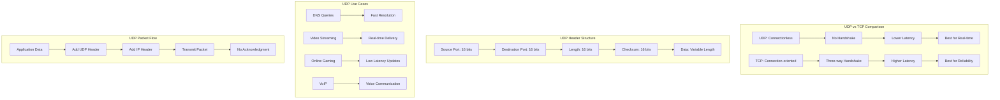

# UDP - User Datagram Protocol

## Definition

UDP (User Datagram Protocol) is a connectionless, lightweight transport layer protocol that provides fast, unreliable data transmission without connection establishment, flow control, or error recovery. UDP operates with minimal overhead, making it ideal for applications that prioritize speed over reliability, such as real-time communications, gaming, and streaming.

Unlike TCP, UDP does not guarantee packet delivery, ordering, or duplicate detection. Applications using UDP must handle these concerns themselves if needed. UDP's simplicity results in lower latency and reduced bandwidth consumption, making it suitable for time-sensitive applications where occasional packet loss is acceptable.

## Core RFC References

- **RFC 768** - User Datagram Protocol specification
- **RFC 8085** - UDP Usage Guidelines
- **RFC 5405** - Unicast UDP Usage Guidelines for Application Designers

## Why It Matters

UDP is essential for applications requiring low latency and high performance:

- **Real-time Communication**: VoIP, video conferencing, and live streaming rely on UDP's speed
- **Gaming**: Online games use UDP for player position updates and real-time interactions
- **DNS Queries**: Domain name resolution uses UDP for fast lookups
- **Network Protocols**: DHCP, SNMP, and routing protocols leverage UDP's efficiency

## Real World Scenario for Engineers

**Scenario**: Building a real-time multiplayer game with global players

You're developing a battle royale game supporting 100 players per match with sub-50ms latency requirements:

- **Player Movement**: UDP packets for position updates (30-60 Hz) - packet loss acceptable
- **Game State Sync**: Critical events (kills, item pickups) need reliability over UDP
- **Voice Chat**: Real-time audio transmission prioritizing low latency over perfect quality
- **Matchmaking**: Use TCP for lobby management, UDP for in-game communication

**Engineering Decisions**:
- Implement custom reliability for critical game events over UDP
- Use sequence numbers and timestamps for packet ordering
- Design client-side prediction to handle packet loss gracefully
- Optimize packet size to fit within single UDP datagrams (avoid fragmentation)

## Mermaid Diagram

