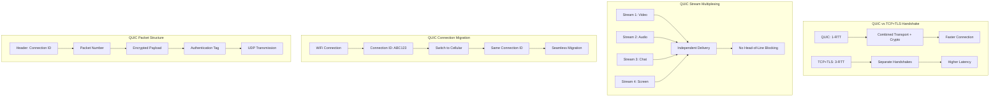

# QUIC - Quick UDP Internet Connections

## Definition

QUIC (Quick UDP Internet Connections) is a modern transport protocol developed by Google that combines the speed of UDP with the reliability and security features traditionally provided by TCP and TLS. QUIC operates over UDP but implements its own connection management, congestion control, and encryption at the application layer, eliminating the need for separate TLS handshakes.

QUIC addresses the limitations of TCP by reducing connection establishment time, eliminating head-of-line blocking through multiplexed streams, and providing built-in encryption. It's designed for modern web applications where low latency and secure communication are critical.

## Core RFC References

- **RFC 9000** - QUIC: A UDP-Based Multiplexed and Secure Transport
- **RFC 9001** - Using TLS to Secure QUIC
- **RFC 9002** - QUIC Loss Detection and Congestion Control
- **RFC 8999** - Version-Independent Properties of QUIC

## Why It Matters

QUIC revolutionizes internet transport by addressing fundamental TCP limitations:

- **Reduced Latency**: 0-RTT connection resumption and 1-RTT initial connections
- **Multiplexing**: Multiple streams without head-of-line blocking
- **Built-in Security**: Encryption is mandatory, not optional
- **Connection Migration**: Seamless handoff between networks (WiFi to cellular)
- **Modern Congestion Control**: Advanced algorithms like BBR

## Real World Scenario for Engineers

**Scenario**: Building a high-performance video conferencing platform

You're architecting a global video conferencing service supporting 10,000+ concurrent users:

- **Connection Setup**: QUIC's 1-RTT handshake vs TCP+TLS 3-RTT saves 100-200ms globally
- **Stream Multiplexing**: Audio, video, screen share, and chat as separate QUIC streams
- **Network Resilience**: QUIC connection migration handles mobile users switching networks
- **Security**: Built-in encryption protects against eavesdropping without performance penalty

**Engineering Benefits**:
- Reduced call setup time improves user experience
- Stream independence prevents video freezing when chat messages are lost
- Connection migration enables seamless mobile experience
- Simplified stack reduces complexity compared to TCP+TLS+WebRTC

**Implementation Considerations**:
- QUIC requires UDP firewall configuration
- Load balancers need QUIC-aware connection routing
- Monitoring tools must understand QUIC connection IDs

## Mermaid Diagram

