# HTTP/1.1 - Hypertext Transfer Protocol Version 1.1

## Definition

HTTP/1.1 (Hypertext Transfer Protocol Version 1.1) is an application-layer protocol that defines how web clients and servers communicate over the internet. HTTP/1.1 operates on a request-response model where clients send HTTP requests to servers, which respond with HTTP responses containing the requested resources or error information.

HTTP/1.1 introduced significant improvements over HTTP/1.0, including persistent connections, chunked transfer encoding, host headers for virtual hosting, and enhanced caching mechanisms. The protocol is stateless, meaning each request is independent, but supports connection reuse to improve performance. HTTP/1.1 forms the foundation of the World Wide Web and remains widely used despite newer versions.

## Core RFC References

- **RFC 7230** - HTTP/1.1: Message Syntax and Routing
- **RFC 7231** - HTTP/1.1: Semantics and Content
- **RFC 7232** - HTTP/1.1: Conditional Requests
- **RFC 7233** - HTTP/1.1: Range Requests
- **RFC 7234** - HTTP/1.1: Caching
- **RFC 7235** - HTTP/1.1: Authentication

## Why It Matters

HTTP/1.1 is fundamental to web architecture and modern applications:

- **Web Foundation**: Powers virtually all web browsers and web applications
- **RESTful APIs**: Standard protocol for REST API communication
- **Microservices**: Enables service-to-service communication in distributed systems
- **Content Delivery**: Supports caching, compression, and content negotiation
- **Security Integration**: Works seamlessly with TLS for HTTPS encryption

## Real World Scenario for Engineers

**Scenario**: Building a high-performance e-commerce API serving mobile and web clients

You're designing an e-commerce platform API that needs to handle 100,000+ requests per minute across mobile apps, web browsers, and partner integrations:

- **RESTful Design**: HTTP methods (GET, POST, PUT, DELETE) map to CRUD operations on products, orders, users
- **Caching Strategy**: Use HTTP cache headers (ETag, Last-Modified, Cache-Control) to reduce server load
- **Content Negotiation**: Support JSON and XML responses based on Accept headers
- **Connection Management**: Implement HTTP keep-alive to reduce connection overhead
- **Error Handling**: Proper HTTP status codes (200, 404, 500) for different scenarios

**Engineering Decisions**:
- Use HTTP/1.1 persistent connections to reduce latency for mobile clients
- Implement conditional requests (If-None-Match) for efficient caching
- Design idempotent APIs using appropriate HTTP methods
- Use chunked transfer encoding for streaming large responses

**Performance Optimizations**:
- Connection pooling to reuse TCP connections
- HTTP compression (gzip) to reduce bandwidth
- Proper cache headers to leverage CDN and browser caches
- Request/response size optimization for mobile networks

## Mermaid Diagram

```mermaid
graph TB
    subgraph "HTTP/1.1 Request-Response"
        A[Client] --> B[HTTP Request]
        B --> C[Server]
        C --> D[HTTP Response]
        D --> A
    end
    
    subgraph "HTTP Request Structure"
        E[Request Line: GET /api/users HTTP/1.1] --> F[Headers: Host, Accept, User-Agent]
        F --> G[Empty Line]
        G --> H[Message Body: Optional]
    end
    
    subgraph "HTTP Response Structure"
        I[Status Line: HTTP/1.1 200 OK] --> J[Headers: Content-Type, Content-Length]
        J --> K[Empty Line]
        K --> L[Message Body: Response Data]
    end
    
    subgraph "HTTP Methods"
        M[GET: Retrieve Data] --> N[Safe & Idempotent]
        O[POST: Create Resource] --> P[Not Idempotent]
        Q[PUT: Update Resource] --> R[Idempotent]
        S[DELETE: Remove Resource] --> T[Idempotent]
    end
    
    subgraph "HTTP Status Codes"
        U[2xx Success] --> V[200 OK, 201 Created]
        W[3xx Redirection] --> X[301 Moved, 304 Not Modified]
        Y[4xx Client Error] --> Z[400 Bad Request, 404 Not Found]
        AA[5xx Server Error] --> BB[500 Internal Error, 503 Unavailable]
    end
```

