# TLS - Transport Layer Security

## Definition

TLS (Transport Layer Security) is a cryptographic protocol that provides secure communication over a computer network. TLS encrypts data in transit between clients and servers, ensuring confidentiality, integrity, and authenticity. It operates between the transport layer (TCP) and application layer, securing protocols like HTTP (creating HTTPS), SMTP, FTP, and others.

TLS evolved from SSL (Secure Sockets Layer) and uses a combination of symmetric and asymmetric cryptography. The protocol establishes a secure channel through a handshake process that negotiates cipher suites, exchanges certificates, and derives shared encryption keys. TLS is fundamental to internet security, protecting everything from web browsing to API communications and financial transactions.

## Core RFC References

- **RFC 8446** - TLS 1.3 (current standard)
- **RFC 5246** - TLS 1.2 (widely deployed)
- **RFC 6066** - TLS Extensions
- **RFC 7627** - TLS Session Hash and Extended Master Secret
- **RFC 8447** - IANA Registry Updates for TLS and DTLS
- **RFC 8449** - Record Size Limit Extension for TLS

## Why It Matters

TLS is critical for modern internet security and applications:

- **Web Security**: Enables HTTPS for secure web browsing and API communications
- **Data Protection**: Encrypts sensitive data like passwords, payment info, and personal data
- **Authentication**: Verifies server identity through digital certificates
- **Compliance**: Required for PCI DSS, GDPR, HIPAA, and other regulatory standards
- **Trust**: Provides the foundation for secure e-commerce and online services

## Real World Scenario for Engineers

**Scenario**: Securing a microservices architecture for a fintech application

You're building a payment processing platform with multiple microservices handling sensitive financial data:

- **API Gateway**: All external traffic enters through HTTPS (TLS 1.3) with strong cipher suites
- **Service-to-Service**: Internal microservices communicate using mutual TLS (mTLS) for zero-trust security
- **Certificate Management**: Automated certificate provisioning and rotation using tools like cert-manager
- **Performance Optimization**: TLS session resumption and connection pooling to minimize handshake overhead
- **Compliance**: TLS configuration meets PCI DSS requirements for payment card data protection

**Engineering Decisions**:
- Use TLS 1.3 for improved security and performance (1-RTT handshake)
- Implement certificate pinning for mobile apps to prevent man-in-the-middle attacks
- Configure perfect forward secrecy (PFS) to protect past communications
- Set up TLS termination at load balancers with backend encryption

**Security Considerations**:
- Regular certificate rotation and monitoring for expiration
- Disable weak cipher suites and protocols (TLS 1.0, 1.1)
- Implement HTTP Strict Transport Security (HSTS) headers
- Monitor TLS configurations for vulnerabilities and compliance

## Mermaid Diagram

```mermaid
graph TB
    subgraph "TLS Handshake Process"
        A[Client Hello] --> B[Server Hello]
        B --> C[Certificate Exchange]
        C --> D[Key Exchange]
        D --> E[Finished Messages]
        E --> F[Secure Communication]
    end
    
    subgraph "TLS 1.3 vs TLS 1.2"
        G[TLS 1.2: 2-RTT Handshake] --> H[Client Hello → Server Hello → Certificate → Key Exchange → Finished]
        I[TLS 1.3: 1-RTT Handshake] --> J[Client Hello + Key Share → Server Hello + Certificate + Finished]
    end
    
    subgraph "Certificate Chain"
        K[Root CA] --> L[Intermediate CA]
        L --> M[Server Certificate]
        M --> N[Public Key + Domain Info]
    end
    
    subgraph "Cipher Suites"
        O[Key Exchange] --> P[ECDHE, RSA, DHE]
        Q[Authentication] --> R[RSA, ECDSA, PSK]
        S[Encryption] --> T[AES-GCM, ChaCha20-Poly1305]
        U[Hash] --> V[SHA-256, SHA-384]
    end
    
    subgraph "TLS Security Features"
        W[Confidentiality] --> X[Symmetric Encryption]
        Y[Integrity] --> Z[Message Authentication Codes]
        AA[Authentication] --> BB[Digital Certificates]
        CC[Perfect Forward Secrecy] --> DD[Ephemeral Key Exchange]
    end
```

