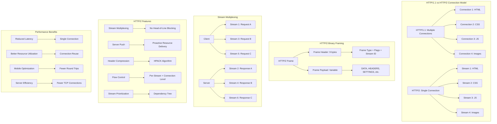

# HTTP/2 - Hypertext Transfer Protocol Version 2

## Definition

HTTP/2 is a major revision of the HTTP protocol that addresses performance limitations of HTTP/1.1 while maintaining semantic compatibility. HTTP/2 introduces binary framing, stream multiplexing, server push, and header compression to significantly improve web performance. The protocol operates over a single TCP connection, eliminating head-of-line blocking at the HTTP layer and reducing connection overhead.

HTTP/2 builds upon HTTP/1.1 semantics but changes how data is formatted and transported. It uses a binary protocol instead of textual, implements flow control, and allows multiple concurrent streams over a single connection. HTTP/2 requires TLS encryption in practice (though not mandated by the specification), ensuring secure and efficient communication for modern web applications.

## Core RFC References

- **RFC 7540** - HTTP/2 Protocol Specification
- **RFC 7541** - HPACK: Header Compression for HTTP/2
- **RFC 8740** - Using TLS 1.3 with HTTP/2
- **RFC 8441** - Bootstrapping WebSockets with HTTP/2
- **RFC 9113** - HTTP/2 (obsoletes RFC 7540)

## Why It Matters

HTTP/2 is crucial for modern web performance and applications:

- **Performance**: Eliminates HTTP/1.1 head-of-line blocking and reduces latency
- **Efficiency**: Single connection reduces server resource usage and improves scalability
- **Mobile Optimization**: Better performance on high-latency mobile networks
- **Modern Web**: Enables real-time features like server push and efficient API communication
- **CDN Integration**: Improves content delivery network performance and caching

## Real World Scenario for Engineers

**Scenario**: Optimizing a high-traffic e-commerce platform serving millions of users globally

You're architecting a modern e-commerce platform that needs to serve product catalogs, user interfaces, and APIs efficiently:

- **Frontend Optimization**: HTTP/2 multiplexing allows loading CSS, JavaScript, images, and API calls concurrently without connection limits
- **API Performance**: Multiple GraphQL/REST API calls can be made simultaneously over a single connection
- **Server Push**: Critical resources (CSS, fonts) can be pushed proactively to reduce page load times
- **Mobile Performance**: Single connection with multiplexing dramatically improves performance on mobile networks
- **Microservices**: HTTP/2 enables efficient service-to-service communication with connection reuse

**Engineering Decisions**:
- Implement HTTP/2 with TLS 1.3 for optimal security and performance
- Use server push strategically for critical above-the-fold resources
- Design APIs to leverage multiplexing (avoid request batching)
- Configure HPACK header compression for repeated API calls

**Performance Optimizations**:
- Stream prioritization to ensure critical resources load first
- Flow control tuning for high-bandwidth connections
- Connection coalescing across subdomains
- Proper cache headers to work with HTTP/2 push cache

## Mermaid Diagram

