# 3.1 SQL over TCP/IP - Database Wire Protocols

## Definition

SQL over TCP/IP refers to the wire protocols used by relational database management systems (RDBMS) to communicate between clients and servers over network connections. These protocols define how SQL queries, results, authentication, and metadata are transmitted across the network. Major implementations include MySQL Wire Protocol, PostgreSQL Frontend/Backend Protocol, and Microsoft SQL Server's Tabular Data Stream (TDS).

Unlike HTTP-based APIs, database wire protocols are optimized for high-frequency, low-latency operations with features like connection pooling, prepared statements, and binary data encoding. They handle authentication, session management, transaction control, and efficient result set streaming.

## Core Specifications

- **MySQL Protocol**: Binary protocol with packet-based communication (MySQL 8.0 Reference Manual)
- **PostgreSQL Protocol**: Message-based frontend/backend protocol (PostgreSQL Documentation)
- **TDS (Tabular Data Stream)**: Microsoft's protocol for SQL Server (MS-TDS Specification)
- **JDBC/ODBC**: Standardized database connectivity APIs that abstract wire protocols
- **Connection Security**: TLS/SSL encryption support across all major implementations

## Why It Matters

Database wire protocols are fundamental to modern application architecture, enabling:

**Performance Optimization**: Binary encoding, prepared statements, and connection reuse reduce network overhead and parsing costs. Connection pooling allows applications to handle thousands of concurrent database operations efficiently.

**Scalability**: Protocol features like asynchronous queries, bulk operations, and streaming result sets enable applications to scale to millions of transactions per second. Load balancers and proxy layers can optimize connection distribution.

**Security**: Built-in authentication mechanisms, encrypted connections, and fine-grained access controls protect sensitive data. Modern protocols support SASL, Kerberos, and certificate-based authentication.

**Ecosystem Integration**: Standardized protocols enable rich tooling ecosystems including ORMs, monitoring tools, backup solutions, and database proxies that work across different database engines.

## Real-World Engineering Scenario

Consider a high-traffic e-commerce platform processing 100,000 orders per minute during peak shopping events. The system architecture relies heavily on optimized database protocols:

**Connection Management**: The application uses connection pools (HikariCP, pgbouncer) to maintain 200 persistent connections to the database cluster, avoiding the overhead of establishing new TCP connections for each transaction.

**Prepared Statements**: Order processing queries use prepared statements to avoid SQL parsing overhead. A single "INSERT INTO orders..." statement template handles thousands of executions per second with different parameter values.

**Transaction Batching**: The protocol's transaction control allows batching multiple related operations (order creation, inventory update, payment processing) into atomic units, ensuring data consistency while minimizing network round trips.

**Read Replicas**: The system leverages protocol-level read/write splitting, directing read queries to replica databases while ensuring write operations go to the primary. This distributes load and improves response times.

**Monitoring and Observability**: Database proxy layers (ProxySQL, PgBouncer) intercept protocol messages to provide real-time metrics on query performance, connection utilization, and error rates without modifying application code.

**Failover and High Availability**: Protocol-aware load balancers detect database failures through connection health checks and automatically redirect traffic to healthy instances, maintaining service availability during infrastructure issues.

This architecture demonstrates how understanding database wire protocols enables engineers to build systems that can handle massive scale while maintaining data consistency and performance.

## Protocol Architecture

```mermaid
graph TB
    subgraph "Database Wire Protocol Architecture"
        Client[📱 Database Client]
        ConnPool[🔄 Connection Pool]
        Proxy[🔀 Database Proxy]
        Primary[🗄️ Primary Database]
        Replica1[📖 Read Replica 1]
        Replica2[📖 Read Replica 2]
        
        subgraph "Protocol Layers"
            App[🔧 Application Layer]
            Wire[📡 Wire Protocol]
            TCP[🌐 TCP Transport]
            TLS[🔒 TLS Security]
        end
        
        subgraph "Protocol Features"
            Auth[🔐 Authentication]
            Prep[📝 Prepared Statements]
            Trans[💾 Transactions]
            Stream[📊 Result Streaming]
        end
        
        subgraph "Message Types"
            Query[❓ Query Messages]
            Result[📋 Result Sets]
            Error[❌ Error Responses]
            Meta[📊 Metadata]
        end
    end
    
    subgraph "Database Engines"
        MySQL[🐬 MySQL Protocol]
        Postgres[🐘 PostgreSQL Protocol]
        SQLServer[🏢 SQL Server TDS]
        Oracle[🔶 Oracle TNS]
    end
    
    subgraph "Performance Optimizations"
        Binary[⚡ Binary Encoding]
        Compress[🗜️ Compression]
        Pipeline[🚀 Pipelining]
        Batch[📦 Batch Operations]
    end
    
    %% Flow connections
    Client --> ConnPool
    ConnPool --> Proxy
    Proxy --> Primary
    Proxy --> Replica1
    Proxy --> Replica2
    
    %% Protocol stack
    App --> Wire
    Wire --> TCP
    TCP --> TLS
    
    %% Protocol features
    Wire --> Auth
    Wire --> Prep
    Wire --> Trans
    Wire --> Stream
    
    %% Message flow
    Query --> Wire
    Result --> Wire
    Error --> Wire
    Meta --> Wire
    
    %% Engine protocols
    MySQL --> Wire
    Postgres --> Wire
    SQLServer --> Wire
    Oracle --> Wire
    
    %% Optimizations
    Binary --> Wire
    Compress --> Wire
    Pipeline --> Wire
    Batch --> Wire
    
    %% Styling
    classDef clientClass fill:#e1f5fe
    classDef protocolClass fill:#f3e5f5
    classDef databaseClass fill:#e8f5e8
    classDef optimizationClass fill:#fff3e0
    
    class Client,ConnPool clientClass
    class Wire,TCP,TLS,Auth,Prep,Trans,Stream protocolClass
    class Primary,Replica1,Replica2,MySQL,Postgres,SQLServer,Oracle databaseClass
    class Binary,Compress,Pipeline,Batch optimizationClass
```

## Key Learning Outcomes

- **Protocol Fundamentals**: Understanding packet structure, message types, and connection lifecycle
- **Performance Engineering**: Leveraging prepared statements, connection pooling, and binary protocols
- **Security Implementation**: Implementing authentication, authorization, and encrypted connections
- **Scalability Patterns**: Read/write splitting, connection multiplexing, and proxy architectures
- **Operational Excellence**: Monitoring, debugging, and optimizing database communication
