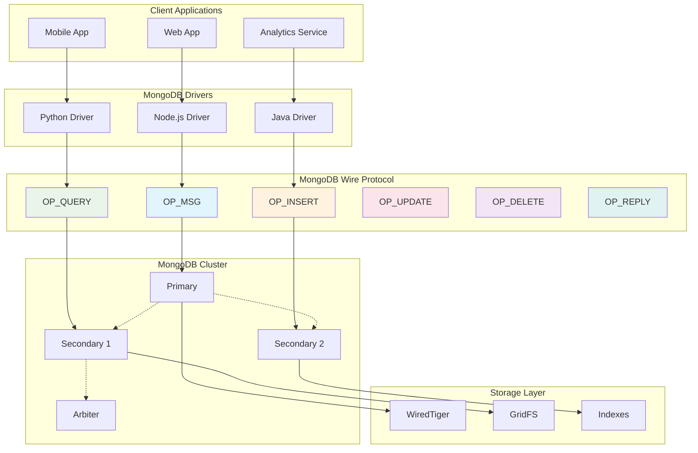

# 3.2 MongoDB Wire Protocol

## Protocol Definition

MongoDB Wire Protocol is the binary communication protocol used between MongoDB clients and servers. It operates over TCP/IP and provides a low-level interface for database operations including queries, inserts, updates, deletes, and administrative commands.

## Core Specifications

- **Transport**: TCP/IP (default port 27017)
- **Message Format**: Binary BSON (Binary JSON) encoding
- **Operations**: OP_QUERY, OP_INSERT, OP_UPDATE, OP_DELETE, OP_MSG, OP_REPLY
- **Authentication**: SCRAM-SHA-1, SCRAM-SHA-256, X.509, LDAP
- **Compression**: Snappy, zlib, zstd (MongoDB 4.2+)

## Why MongoDB Wire Protocol Matters

MongoDB's wire protocol enables:
- **High Performance**: Binary encoding reduces serialization overhead
- **Rich Data Types**: Native support for documents, arrays, dates, ObjectIds
- **Flexible Queries**: Complex aggregation pipelines and geospatial queries
- **Horizontal Scaling**: Sharding and replica set communication
- **Real-time Operations**: Change streams and tailable cursors

## Real-World Engineering Scenario

**E-commerce Product Catalog with Real-Time Inventory**

You're building a high-traffic e-commerce platform where:
- Product catalog requires complex queries (text search, faceted filtering, geolocation)
- Inventory updates happen in real-time across multiple warehouses
- User sessions store shopping carts and preferences
- Analytics require aggregation across millions of transactions

MongoDB Wire Protocol handles:
1. **Document Queries**: Find products by category, price range, location
2. **Aggregation Pipelines**: Real-time analytics and reporting
3. **Change Streams**: Live inventory updates to connected clients
4. **Bulk Operations**: Efficient batch processing of orders
5. **GridFS**: Large file storage for product images and videos

## MongoDB Wire Protocol Architecture



## Performance Characteristics

- **Latency**: Sub-millisecond for indexed queries
- **Throughput**: 100K+ operations/second on modern hardware
- **Compression**: 60-80% size reduction with Snappy/zlib
- **Connection Pooling**: Efficient resource utilization
- **Batch Operations**: Reduced network round trips

## Security Features

- **Authentication**: Multiple mechanisms (SCRAM, X.509, LDAP)
- **Authorization**: Role-based access control (RBAC)
- **Encryption**: TLS/SSL for wire encryption
- **Auditing**: Comprehensive operation logging
- **Field-Level Encryption**: Client-side encryption for sensitive data

## Code Examples

Refer to the following implementations:
- `mongodb_wire_protocol.py` - Core protocol simulation
- `mongodb_operations.py` - CRUD operations and aggregation
- `render_diagram.py` - Visual protocol diagrams

## Running the Examples

```bash
make test
```

This demonstrates MongoDB wire protocol operations, connection management, and performance optimization patterns used in production MongoDB deployments.
