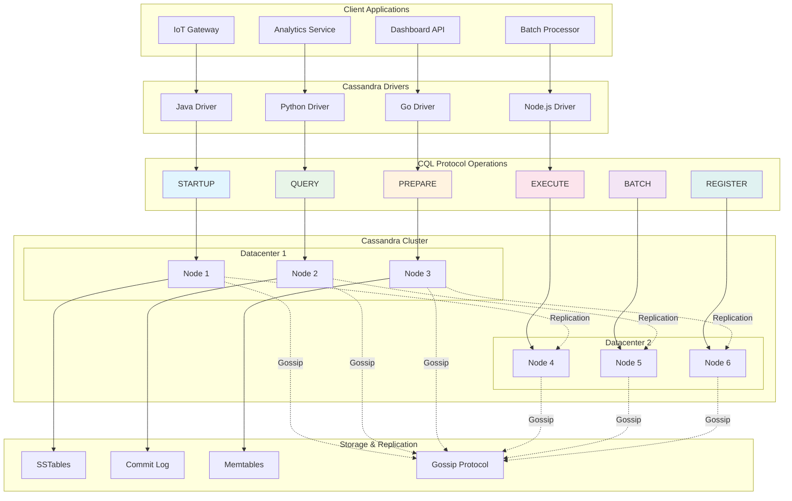

# 3.3 Cassandra Query Protocol (CQL)

## Protocol Definition

Cassandra Query Protocol (CQL) is the native binary protocol for Apache Cassandra, providing efficient communication between clients and Cassandra clusters. It operates over TCP/IP and supports the Cassandra Query Language (CQL), offering SQL-like syntax for NoSQL operations.

## Core Specifications

- **Transport**: TCP/IP (default port 9042)
- **Protocol Versions**: v3, v4, v5 (latest)
- **Message Format**: Binary frames with compression support
- **Operations**: QUERY, PREPARE, EXECUTE, BATCH, REGISTER
- **Compression**: LZ4, Snappy, DEFLATE
- **Authentication**: SASL (PLAIN, GSSAPI), X.509 certificates

## Why Cassandra Protocol Matters

Cassandra's protocol enables:
- **Linear Scalability**: Add nodes without downtime or performance degradation
- **High Availability**: No single point of failure with tunable consistency
- **Global Distribution**: Multi-datacenter replication with local reads/writes
- **Time-Series Optimization**: Efficient storage and querying of time-ordered data
- **Massive Write Throughput**: Optimized for write-heavy workloads

## Real-World Engineering Scenario

**IoT Sensor Data Platform with Global Distribution**

You're building a global IoT platform where:
- Millions of sensors send telemetry data every second
- Data must be stored across multiple geographic regions
- Real-time dashboards require low-latency reads
- Historical analytics need efficient time-range queries
- System must handle node failures gracefully

Cassandra Protocol handles:
1. **Prepared Statements**: Efficient repeated sensor data inserts
2. **Batch Operations**: Atomic writes across multiple sensor readings
3. **Consistency Levels**: Tunable consistency for different use cases
4. **Token-Aware Routing**: Direct client connections to data owners
5. **Compression**: Reduced network overhead for high-volume data

## Cassandra Protocol Architecture



## Performance Characteristics

- **Write Throughput**: 100K+ writes/second per node
- **Read Latency**: Sub-millisecond for single partition reads
- **Scalability**: Linear scaling to hundreds of nodes
- **Availability**: 99.99%+ uptime with proper replication
- **Compression**: 60-80% reduction with LZ4/Snappy

## Security Features

- **Authentication**: SASL mechanisms, certificate-based auth
- **Authorization**: Role-based access control (RBAC)
- **Encryption**: TLS/SSL for client-server and inter-node communication
- **Auditing**: Comprehensive operation logging
- **Network Security**: IP allowlisting, VPC isolation

## Code Examples

Refer to the following implementations:
- `cassandra_protocol.py` - Core CQL protocol simulation
- `cassandra_operations.py` - CRUD operations and consistency levels
- `render_diagram.py` - Visual protocol diagrams

## Running the Examples

```bash
make test
```

This demonstrates Cassandra protocol operations, consistency tuning, and distributed architecture patterns used in production Cassandra deployments.
