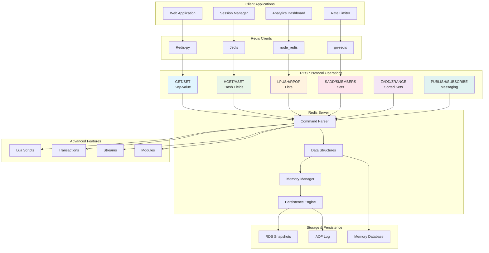

# 3.4 Redis RESP Protocol

## Protocol Definition

Redis Serialization Protocol (RESP) is the wire protocol used by Redis clients to communicate with the Redis server. It's a simple, human-readable protocol that operates over TCP/IP and supports various data types including strings, arrays, integers, bulk strings, and errors.

## Core Specifications

- **Transport**: TCP/IP (default port 6379)
- **Protocol Versions**: RESP2, RESP3 (Redis 6.0+)
- **Message Format**: Text-based with binary-safe bulk strings
- **Data Types**: Simple Strings, Errors, Integers, Bulk Strings, Arrays
- **Pipelining**: Multiple commands without waiting for replies
- **Pub/Sub**: Real-time messaging with channels and patterns

## Why Redis RESP Protocol Matters

Redis RESP enables:
- **High Performance**: Simple protocol with minimal parsing overhead
- **Human Readable**: Easy debugging and monitoring
- **Language Agnostic**: Simple implementation in any programming language
- **Pipelining Support**: Batch multiple commands for improved throughput
- **Real-time Features**: Pub/Sub messaging and blocking operations

## Real-World Engineering Scenario

**High-Performance Caching Layer with Real-Time Analytics**

You're building a real-time analytics platform where:
- Web applications need sub-millisecond cache lookups
- Session data must be shared across multiple application servers
- Real-time dashboards require live data updates via pub/sub
- Rate limiting needs distributed counters with expiration
- Leaderboards require sorted sets with real-time updates

Redis RESP Protocol handles:
1. **GET/SET Operations**: Ultra-fast key-value caching
2. **Hash Operations**: Efficient session data storage
3. **Pub/Sub Messaging**: Real-time dashboard updates
4. **Sorted Sets**: Live leaderboards and rankings
5. **Atomic Counters**: Rate limiting and analytics

## Redis RESP Protocol Architecture



## Performance Characteristics

- **Latency**: Sub-millisecond for simple operations
- **Throughput**: 100K+ operations/second on single instance
- **Memory Efficiency**: Optimized data structures and compression
- **Pipelining**: 10x throughput improvement for batch operations
- **Persistence**: Configurable durability vs performance trade-offs

## Security Features

- **Authentication**: Password-based and ACL (Redis 6.0+)
- **Authorization**: User-based command restrictions
- **Encryption**: TLS/SSL support for client connections
- **Network Security**: Bind address restrictions, protected mode
- **Command Filtering**: Disable dangerous commands in production

## Code Examples

Refer to the following implementations:
- `redis_protocol.py` - Core RESP protocol simulation
- `redis_operations.py` - Data structures and pub/sub operations
- `render_diagram.py` - Visual protocol diagrams

## Running the Examples

```bash
make test
```

This demonstrates Redis RESP protocol operations, data structures, and real-time messaging patterns used in production Redis deployments.
