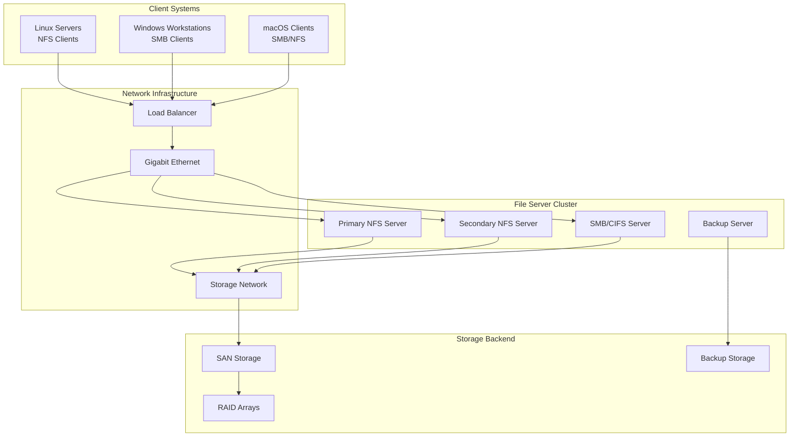

# NFS & SMB Network File System Protocols

## Protocol Definition

**NFS (Network File System)** and **SMB (Server Message Block)** are distributed file system protocols that enable remote file access over networks. NFS is primarily Unix/Linux-based, while SMB (also known as CIFS) is Microsoft's file sharing protocol.

### NFS Protocol Stack
- **NFS v3**: Stateless protocol over UDP/TCP (RFC 1813)
- **NFS v4**: Stateful protocol over TCP with enhanced security (RFC 7530)
- **RPC**: Remote Procedure Call layer (RFC 5531)
- **XDR**: External Data Representation for serialization (RFC 4506)

### SMB Protocol Stack
- **SMB 1.0**: Original protocol with security vulnerabilities
- **SMB 2.0/2.1**: Improved performance and security (Windows Vista/7)
- **SMB 3.0/3.1**: Encryption, multichannel, clustering (Windows 8/10)
- **NetBIOS**: Network Basic Input/Output System (legacy)

## Real-World Engineering Scenario

**Enterprise File Server Infrastructure:**

A large organization needs centralized file storage accessible from mixed environments:
- **Linux servers** using NFS for application data and logs
- **Windows workstations** using SMB for user home directories
- **High availability** with clustered file servers
- **Performance optimization** with caching and load balancing



## Architecture & Components

### NFS Architecture
1. **VFS Layer**: Virtual File System interface
2. **NFS Client**: Kernel module handling remote operations
3. **RPC Client**: Remote procedure call mechanism
4. **Network Transport**: TCP/UDP communication
5. **NFS Server**: Exports file systems to clients
6. **Local File System**: Underlying storage (ext4, XFS, ZFS)

### SMB Architecture
1. **SMB Client**: Windows/Samba client implementation
2. **Session Layer**: Authentication and session management
3. **Tree Connect**: Share mounting and permissions
4. **File Operations**: Open, read, write, close operations
5. **SMB Server**: File sharing service (Windows Server/Samba)
6. **NTFS/ReFS**: Windows file system backend

## Performance Characteristics

### NFS Performance
- **NFSv3**: 50-100 MB/s typical throughput
- **NFSv4**: 100-200 MB/s with improved caching
- **Latency**: 1-5ms for metadata operations
- **Concurrent clients**: 100-1000+ depending on server

### SMB Performance
- **SMB 2.1**: 100-200 MB/s single stream
- **SMB 3.0**: 300-500 MB/s with multichannel
- **SMB Direct**: 1-10 GB/s over RDMA networks
- **Oplocks**: Client-side caching for performance

## Security Features

### NFS Security
- **AUTH_SYS**: Traditional Unix UID/GID authentication
- **Kerberos v5**: Strong authentication (RPCSEC_GSS)
- **IPSec**: Network-layer encryption
- **Export controls**: Host-based access restrictions

### SMB Security
- **NTLM**: NT LAN Manager authentication
- **Kerberos**: Active Directory integration
- **SMB Signing**: Message integrity protection
- **SMB Encryption**: AES-128/256 encryption (SMB 3.0+)

## Code Examples

### NFS Client Simulation
```python
# See nfs_client.py for complete implementation
nfs_client = NFSClient("fileserver.example.com")
nfs_client.mount("/export/data", "/mnt/nfs")
nfs_client.read_file("/mnt/nfs/document.txt")
```

### SMB Client Operations
```python
# See smb_client.py for complete implementation
smb_client = SMBClient("\\\\server\\share")
smb_client.authenticate("domain\\user", "password")
smb_client.list_directory("\\Documents")
```

### Performance Monitoring
```python
# See file_system_monitor.py for complete implementation
monitor = FileSystemMonitor()
monitor.track_nfs_performance()
monitor.track_smb_performance()
```

## Running the Code

```bash
# Run NFS protocol simulation
python3 nfs_client.py

# Run SMB protocol simulation  
python3 smb_client.py

# Run file system monitoring
python3 file_system_monitor.py

# Generate protocol diagrams
python3 render_diagram.py

# Run all tests
make test
```

NFS and SMB protocols enable seamless distributed file access across heterogeneous networks, providing the foundation for enterprise file sharing and collaboration systems.
