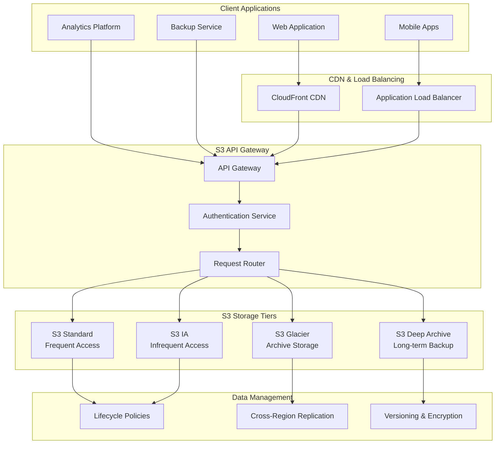

# S3 API - Amazon S3 Compatible Storage Protocol

## Protocol Definition

**Amazon S3 API** is a RESTful web service protocol for object storage that has become the de facto standard for cloud storage. It provides simple HTTP-based operations for storing and retrieving objects in buckets with rich metadata and access control.

### S3 Protocol Stack
- **HTTP/1.1 or HTTP/2**: Transport protocol (RFC 7230-7235)
- **TLS 1.2/1.3**: Encryption and security (RFC 5246, RFC 8446)
- **REST**: Representational State Transfer architecture
- **XML/JSON**: Data serialization formats
- **AWS Signature V4**: Authentication and authorization

### Core Concepts
- **Buckets**: Top-level containers for objects (globally unique names)
- **Objects**: Files with metadata (up to 5TB per object)
- **Keys**: Unique identifiers for objects within buckets
- **Regions**: Geographic locations for data residency
- **Storage Classes**: Different performance/cost tiers

## Real-World Engineering Scenario

**Multi-Tier Cloud Storage Architecture:**

A modern application needs scalable object storage for various use cases:
- **Static web assets** (images, CSS, JavaScript) with CDN integration
- **User uploads** (documents, photos) with lifecycle management
- **Application backups** with cross-region replication
- **Data analytics** with direct query capabilities (S3 Select)
- **Content distribution** with signed URLs and access policies



## Architecture & Components

### S3 API Operations
1. **Bucket Operations**: CreateBucket, DeleteBucket, ListBuckets, GetBucketLocation
2. **Object Operations**: PutObject, GetObject, DeleteObject, ListObjects
3. **Multipart Upload**: InitiateMultipartUpload, UploadPart, CompleteMultipartUpload
4. **Access Control**: PutBucketPolicy, GetBucketAcl, PutObjectAcl
5. **Metadata Operations**: HeadObject, CopyObject, GetObjectAttributes

### Authentication & Security
- **AWS Signature V4**: HMAC-SHA256 request signing
- **IAM Policies**: Fine-grained access control
- **Bucket Policies**: Resource-based permissions
- **Pre-signed URLs**: Time-limited access tokens
- **Server-Side Encryption**: AES-256, KMS, Customer-provided keys

## Performance Characteristics

### Throughput & Latency
- **PUT/POST/DELETE**: 3,500 requests/second per prefix
- **GET/HEAD**: 5,500 requests/second per prefix
- **Transfer Acceleration**: Up to 6x faster uploads via CloudFront
- **Multipart Upload**: Parallel uploads for objects >100MB
- **Typical Latency**: 100-200ms first byte, <10ms subsequent

### Scalability
- **Object Size**: 0 bytes to 5TB per object
- **Bucket Capacity**: Virtually unlimited
- **Request Rate**: Auto-scaling based on traffic patterns
- **Bandwidth**: Multi-gigabit per connection
- **Concurrent Connections**: Thousands per client

## Security Features

### Encryption
- **Encryption in Transit**: TLS 1.2+ for all API calls
- **Server-Side Encryption**: SSE-S3, SSE-KMS, SSE-C
- **Client-Side Encryption**: Application-level encryption
- **Bucket Encryption**: Default encryption policies

### Access Control
- **IAM Integration**: User and role-based permissions
- **Bucket Policies**: JSON-based access rules
- **Access Control Lists**: Legacy permission model
- **VPC Endpoints**: Private network access
- **CloudTrail**: Comprehensive API logging

## Code Examples

### S3 Client Operations
```python
# See s3_client.py for complete implementation
s3_client = S3Client("https://s3.amazonaws.com", "my-bucket")
s3_client.authenticate("access_key", "secret_key")
s3_client.put_object("document.pdf", file_data)
```

### Multipart Upload
```python
# See s3_multipart.py for complete implementation
uploader = S3MultipartUploader(s3_client, "large-file.zip")
uploader.initiate_upload()
uploader.upload_parts(file_data, chunk_size=5*1024*1024)
```

### Storage Analytics
```python
# See s3_analytics.py for complete implementation
analytics = S3Analytics(s3_client)
analytics.analyze_storage_usage()
analytics.generate_cost_report()
```

## Running the Code

```bash
# Run S3 client simulation
python3 s3_client.py

# Run multipart upload demo
python3 s3_multipart.py

# Run storage analytics
python3 s3_analytics.py

# Generate protocol diagrams
python3 render_diagram.py

# Run all tests
make test
```

The S3 API provides a robust, scalable foundation for modern cloud storage architectures, enabling everything from simple file storage to complex data lakes and content distribution networks.
