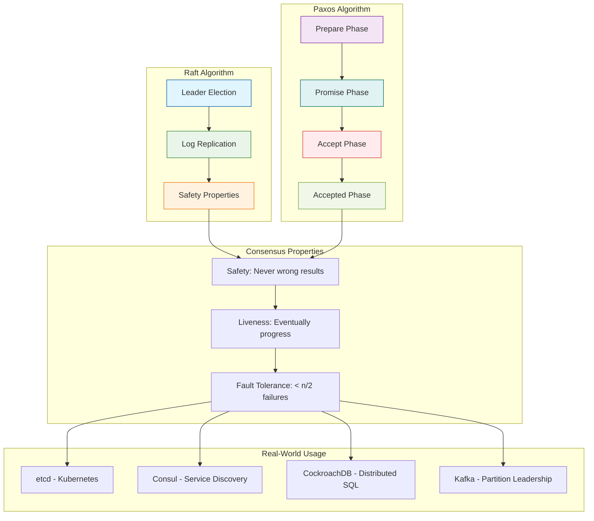

# Raft & Paxos Consensus Protocols

## Definition

Raft and Paxos are consensus algorithms that enable distributed systems to agree on a single value or sequence of values, even in the presence of network partitions and node failures. These protocols are fundamental building blocks for distributed databases, configuration management systems, and any application requiring strong consistency across multiple nodes.

Raft, designed for understandability, uses leader election and log replication to achieve consensus. Paxos, the theoretical foundation for many consensus systems, uses a more complex but proven approach with proposers, acceptors, and learners to reach agreement even under Byzantine conditions.

Both protocols guarantee safety (never returning incorrect results) and liveness (eventually making progress) under specific network assumptions, making them essential for mission-critical distributed systems.

## Core RFC References

- **Raft Consensus Algorithm**: [Raft Paper](https://raft.github.io/raft.pdf) - "In Search of an Understandable Consensus Algorithm"
- **Paxos Algorithm**: Leslie Lamport's "Paxos Made Simple" and "The Part-Time Parliament"
- **Multi-Paxos**: Extensions for practical implementation in distributed systems
- **RAFT Extensions**: Pre-vote, leadership transfer, and configuration changes

## Why It Matters

Consensus algorithms are the backbone of modern distributed systems. Without reliable consensus, distributed databases would suffer from split-brain scenarios, configuration systems would provide inconsistent views, and distributed applications would fail to maintain data integrity.

**Real-world impact:**
- **etcd** (Kubernetes' backing store) uses Raft for cluster coordination
- **Apache Kafka** uses a Raft-like protocol for partition leadership
- **CockroachDB** and **TiDB** use Raft for distributed SQL consistency
- **Consul** and **Zookeeper** rely on consensus for service discovery
- **Blockchain networks** use consensus variants for transaction ordering

## Real-World Scenario for Engineers

**Scenario: Distributed Database Cluster Management**

You're designing a distributed SQL database that must maintain consistency across 5 nodes in different data centers. When a client writes data, all nodes must agree on the order of operations to prevent conflicts.

**System Design Challenge:**
```
Client Write → [Node1] [Node2] [Node3] [Node4] [Node5]
                  ↓       ↓       ↓       ↓       ↓
               Which node becomes leader?
               How to handle network partitions?
               What if nodes crash during consensus?
```

**Raft Solution:**
1. **Leader Election**: Nodes vote for a leader using randomized timeouts
2. **Log Replication**: Leader receives writes, replicates to followers
3. **Commitment**: Only commit entries replicated to majority (3/5 nodes)
4. **Failure Handling**: New leader election if current leader fails

**Engineering Considerations:**
- **Latency vs Consistency**: Raft requires majority agreement (higher latency)
- **Split-Brain Prevention**: Minority partitions cannot make progress
- **Operational Complexity**: Leader election, log compaction, membership changes
- **Performance Tuning**: Heartbeat intervals, election timeouts, batch sizes

This scenario demonstrates why consensus is critical for maintaining data integrity in distributed systems while handling real-world network and hardware failures.

## Raft vs Paxos Comparison



## Example Code References

- `raft_consensus.py` - Raft leader election and log replication simulation
- `paxos_consensus.py` - Multi-Paxos implementation with proposers and acceptors
- `consensus_comparison.py` - Performance and behavior comparison between algorithms

## Run Instructions

```bash
# Run Raft consensus simulation
make raft

# Run Paxos consensus simulation  
make paxos

# Compare both algorithms
make comparison

# Generate all diagrams
make diagrams

# Run all tests
make test
```
