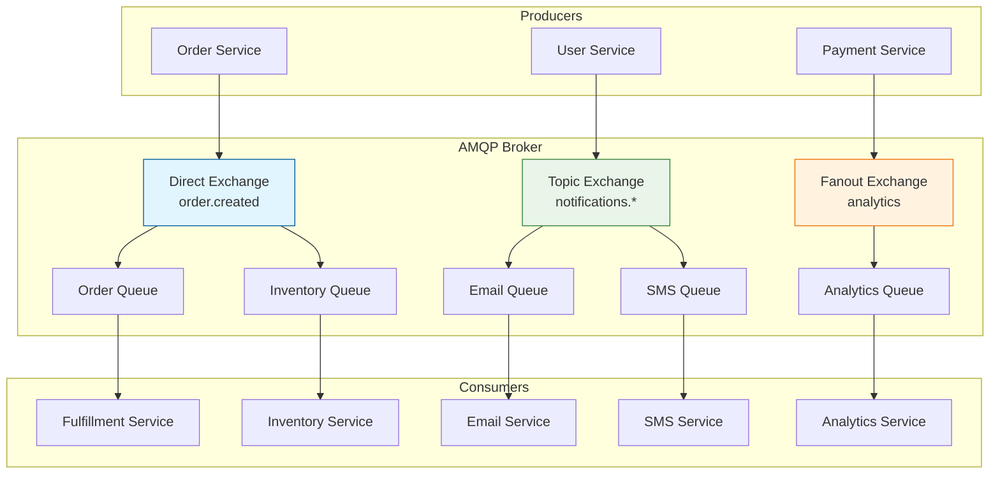

# AMQP (Advanced Message Queuing Protocol)

## Definition

AMQP is an open standard application layer protocol for message-oriented middleware. It provides reliable, secure, and interoperable messaging between applications and organizations. AMQP defines both a wire-level protocol and a messaging model that enables complex routing, queuing, and delivery guarantees.

## Core References

- **AMQP 0-9-1 Specification**: Most widely implemented version
- **AMQP 1.0 (ISO/IEC 19464:2014)**: International standard with different model
- **RFC 5672**: AMQP 0-9-1 specification details
- **OASIS AMQP 1.0**: Official OASIS standard

## Real-World Impact

AMQP powers mission-critical messaging infrastructure across industries:

**Financial Services**: High-frequency trading systems, payment processing, risk management
- Goldman Sachs uses AMQP for real-time market data distribution
- JPMorgan Chase leverages AMQP for transaction processing pipelines

**E-commerce**: Order processing, inventory management, notification systems
- Amazon uses AMQP-based messaging for order fulfillment workflows
- Shopify employs AMQP for real-time inventory synchronization

**Telecommunications**: Network management, billing systems, service provisioning
- Ericsson uses AMQP for network element management
- Cisco implements AMQP in network orchestration platforms

## Engineering Scenario

You're building a distributed e-commerce platform that needs to handle:
- Order processing across multiple services
- Real-time inventory updates
- Customer notifications
- Payment processing workflows
- Analytics data collection

**Challenge**: Traditional point-to-point messaging creates tight coupling and doesn't scale. You need:
- Guaranteed message delivery
- Complex routing patterns
- Transaction support
- High availability
- Interoperability between different services

**AMQP Solution**: Implements a broker-based messaging model with:
- **Exchanges**: Route messages based on routing keys and headers
- **Queues**: Store messages until consumers are ready
- **Bindings**: Define routing rules between exchanges and queues
- **Channels**: Multiplexed connections for efficient resource usage

## AMQP Architecture



## Key Features

**Message Routing**:
- Direct Exchange: Route by exact routing key match
- Topic Exchange: Route by pattern matching (wildcards)
- Fanout Exchange: Broadcast to all bound queues
- Headers Exchange: Route by message headers

**Delivery Guarantees**:
- At-most-once: Fast, no duplicates, possible message loss
- At-least-once: No message loss, possible duplicates
- Exactly-once: No loss, no duplicates (with transactions)

**Quality of Service**:
- Message acknowledgments
- Publisher confirms
- Persistent messages
- Queue durability
- Consumer prefetch control

## Example Code

See the following implementations:

- `amqp_broker.py` - AMQP broker simulation with exchanges and queues
- `amqp_client.py` - Producer and consumer client implementations
- `message_patterns.py` - Common messaging patterns and routing examples

## Run Instructions

```bash
# Run AMQP broker simulation
python3 amqp_broker.py

# Run client examples
python3 amqp_client.py

# Run messaging patterns demo
python3 message_patterns.py

# Generate diagrams
python3 render_diagram.py

# Run all tests
make test
```

AMQP provides the foundation for building scalable, reliable, and maintainable distributed systems through standardized messaging patterns and delivery guarantees.
