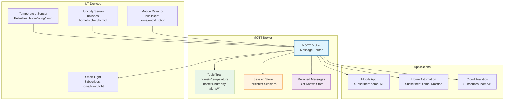

# MQTT (Message Queuing Telemetry Transport)

## Definition

MQTT is a lightweight, publish-subscribe messaging protocol designed for constrained devices and low-bandwidth, high-latency networks. Originally developed by IBM for oil pipeline monitoring, MQTT has become the de facto standard for IoT communication due to its minimal overhead and reliable delivery mechanisms.

## Core References

- **MQTT 3.1.1 (ISO/IEC 20922:2016)**: Current stable standard
- **MQTT 5.0**: Latest version with enhanced features
- **RFC 6455**: WebSocket protocol (for MQTT over WebSockets)
- **OASIS MQTT Technical Committee**: Standards development

## Real-World Impact

MQTT powers billions of IoT devices across critical infrastructure:

**Smart Cities**: Traffic management, environmental monitoring, energy grids
- Barcelona uses MQTT for 20,000+ smart meters and sensors
- Amsterdam leverages MQTT for traffic optimization and air quality monitoring

**Industrial IoT**: Manufacturing automation, predictive maintenance, supply chain
- General Electric uses MQTT for Predix industrial platform
- Siemens implements MQTT in factory automation systems

**Connected Vehicles**: Tesla, BMW, and Ford use MQTT for vehicle telemetry
- Real-time diagnostics and over-the-air updates
- Fleet management and predictive maintenance

**Healthcare**: Remote patient monitoring, medical device connectivity
- Philips uses MQTT for hospital equipment monitoring
- Continuous glucose monitors rely on MQTT for data transmission

## Engineering Scenario

You're building a smart home ecosystem that needs to handle:
- 100+ IoT devices (sensors, actuators, cameras)
- Intermittent network connectivity
- Battery-powered devices with limited resources
- Real-time automation rules
- Mobile app notifications

**Challenge**: Traditional HTTP polling is too resource-intensive. You need:
- Minimal network overhead
- Automatic reconnection handling
- Quality of Service guarantees
- Hierarchical topic organization
- Last Will and Testament for device failures

**MQTT Solution**: Provides a broker-based pub-sub model with:
- **Lightweight Protocol**: 2-byte fixed header, minimal overhead
- **QoS Levels**: Fire-and-forget, at-least-once, exactly-once delivery
- **Retained Messages**: Last known state for new subscribers
- **Clean/Persistent Sessions**: Handle intermittent connectivity
- **Last Will**: Automatic notification when devices disconnect unexpectedly

## MQTT Architecture



## Key Features

**Quality of Service Levels**:
- QoS 0: At most once (fire and forget)
- QoS 1: At least once (acknowledged delivery)
- QoS 2: Exactly once (assured delivery)

**Topic Hierarchy**:
- Forward slash separated: `home/living/temperature`
- Wildcards: `+` (single level), `#` (multi-level)
- Retained messages for last known state

**Session Management**:
- Clean Session: Temporary, no state persistence
- Persistent Session: Survives disconnections, queues messages

**Connection Features**:
- Keep Alive: Heartbeat mechanism
- Last Will and Testament: Notification on unexpected disconnect
- Username/Password authentication
- TLS/SSL encryption support

## Example Code

See the following implementations:

- `mqtt_broker.py` - MQTT broker simulation with topic routing and QoS
- `mqtt_client.py` - Publisher and subscriber client implementations  
- `iot_simulation.py` - Smart home IoT device simulation

## Run Instructions

```bash
# Run MQTT broker simulation
python3 mqtt_broker.py

# Run client examples
python3 mqtt_client.py

# Run IoT device simulation
python3 iot_simulation.py

# Generate diagrams
python3 render_diagram.py

# Run all tests
make test
```

MQTT enables scalable, reliable IoT communication with minimal resource requirements, making it ideal for battery-powered devices and constrained networks.
