# STOMP (Simple Text Oriented Messaging Protocol)

## Definition

STOMP is a simple, text-based messaging protocol that provides an interoperable wire format for messaging systems. Designed for simplicity and ease of implementation, STOMP allows clients written in different languages to communicate with message brokers through a straightforward frame-based protocol over TCP connections.

## Core References

- **STOMP Protocol 1.2**: Current stable specification
- **STOMP Protocol 1.1**: Widely supported version
- **RFC 6455**: WebSocket protocol (STOMP over WebSockets)
- **Apache ActiveMQ**: Reference implementation

## Real-World Impact

STOMP enables simple messaging integration across diverse technology stacks:

**Enterprise Integration**: Cross-platform messaging between Java, .NET, Python, Ruby applications
- LinkedIn uses STOMP for real-time activity feeds
- Netflix leverages STOMP for microservice communication

**Web Applications**: Real-time notifications and chat systems
- Spring Framework provides native STOMP support for WebSocket messaging
- Ruby on Rails ActionCable uses STOMP for real-time features

**Financial Services**: Trading systems and market data distribution
- Simple protocol reduces latency compared to complex binary protocols
- Easy debugging with human-readable text frames

## Engineering Scenario

You're building a real-time collaboration platform that needs:
- WebSocket-based real-time messaging
- Multi-language client support (JavaScript, Java, Python)
- Simple debugging and monitoring
- Message acknowledgments and transactions
- Topic-based subscriptions

**Challenge**: Complex binary protocols are hard to debug and implement across languages. You need:
- Human-readable message format
- Simple frame structure
- Built-in acknowledgment mechanisms
- Transaction support
- Easy WebSocket integration

**STOMP Solution**: Provides a text-based protocol with:
- **Simple Frames**: Command, headers, and body structure
- **Clear Commands**: CONNECT, SEND, SUBSCRIBE, ACK, NACK, DISCONNECT
- **Header-based Metadata**: Content-type, destination, receipt handling
- **Transaction Support**: BEGIN, COMMIT, ABORT for atomic operations
- **WebSocket Compatibility**: Direct mapping over WebSocket frames

## STOMP Architecture

```mermaid
graph TB
    subgraph "STOMP Broker"
        BROKER[STOMP Broker<br/>Message Router]
        DEST[Destinations<br/>/queue/orders<br/>/topic/notifications]
        TRANS[Transaction Manager<br/>BEGIN/COMMIT/ABORT]
        SUBS[Subscription Manager<br/>Client Subscriptions]
        
        BROKER --> DEST
        BROKER --> TRANS
        BROKER --> SUBS
    end
    
    subgraph "STOMP Clients"
        WEB[Web Client<br/>JavaScript/WebSocket]
        JAVA[Java Client<br/>Spring STOMP]
        PYTHON[Python Client<br/>stomp.py]
        RUBY[Ruby Client<br/>stomp gem]
    end
    
    subgraph "Message Flow"
        CONNECT[CONNECT<br/>Authentication]
        SUBSCRIBE[SUBSCRIBE<br/>destination: /topic/chat]
        SEND[SEND<br/>destination: /queue/orders]
        MESSAGE[MESSAGE<br/>Delivery to subscribers]
        ACK[ACK<br/>Message acknowledgment]
        
        CONNECT --> SUBSCRIBE
        SUBSCRIBE --> SEND
        SEND --> MESSAGE
        MESSAGE --> ACK
    end
    
    WEB --> BROKER
    JAVA --> BROKER
    PYTHON --> BROKER
    RUBY --> BROKER
    
    BROKER --> WEB
    BROKER --> JAVA
    BROKER --> PYTHON
    BROKER --> RUBY
    
    style BROKER fill:#e1f5fe,stroke:#01579b
    style DEST fill:#e8f5e8,stroke:#2e7d32
    style TRANS fill:#fff3e0,stroke:#ef6c00
    style CONNECT fill:#f3e5f5,stroke:#7b1fa2
```



## Key Features

**Frame Structure**:
```
COMMAND
header1:value1
header2:value2

Body^@
```

**Core Commands**:
- CONNECT: Establish connection with broker
- SEND: Send message to destination
- SUBSCRIBE: Subscribe to destination
- ACK/NACK: Acknowledge or reject message
- BEGIN/COMMIT/ABORT: Transaction control
- DISCONNECT: Close connection gracefully

**Destination Types**:
- Queues: Point-to-point messaging (`/queue/orders`)
- Topics: Publish-subscribe messaging (`/topic/notifications`)

**Acknowledgment Modes**:
- auto: Automatic acknowledgment
- client: Manual acknowledgment required
- client-individual: Individual message acknowledgment

## Example Code

See the following implementations:

- `stomp_broker.py` - STOMP broker simulation with frame parsing and routing
- `stomp_client.py` - Client implementation with WebSocket support
- `chat_application.py` - Real-time chat application using STOMP

## Run Instructions

```bash
# Run STOMP broker simulation
python3 stomp_broker.py

# Run client examples
python3 stomp_client.py

# Run chat application demo
python3 chat_application.py

# Generate diagrams
python3 render_diagram.py

# Run all tests
make test
```

STOMP provides a simple, debuggable messaging protocol that's ideal for web applications and cross-language integration scenarios.
