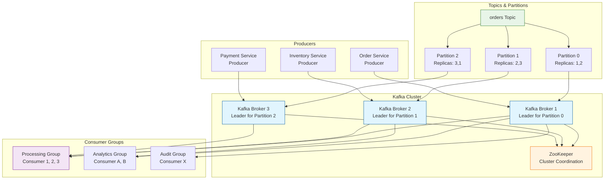

# Kafka (Apache Kafka)

## Definition

Apache Kafka is a distributed streaming platform designed for high-throughput, fault-tolerant, real-time data streaming. Built as a distributed commit log, Kafka provides publish-subscribe messaging with strong durability guarantees, horizontal scalability, and low-latency data processing capabilities for modern data-driven applications.

## Core References

- **Apache Kafka Protocol**: Binary protocol specification
- **Kafka Improvement Proposals (KIPs)**: Protocol evolution
- **Apache Kafka Documentation**: Official implementation guide
- **Confluent Platform**: Enterprise Kafka distribution

## Real-World Impact

Kafka powers real-time data infrastructure at massive scale:

**Streaming Analytics**: Real-time data processing and analytics
- Netflix processes 8+ trillion events daily through Kafka
- LinkedIn handles 7+ million messages per second

**Event Sourcing**: Immutable event logs for microservices
- Uber uses Kafka for real-time trip tracking and pricing
- Airbnb leverages Kafka for booking and payment events

**Data Integration**: Connecting diverse data systems
- Goldman Sachs uses Kafka for trade settlement and risk management
- Spotify streams music recommendation events through Kafka

## Engineering Scenario

You're building a real-time e-commerce platform that needs:
- High-throughput order processing (100k+ orders/second)
- Real-time inventory updates across multiple warehouses
- Customer activity tracking for recommendations
- Fault-tolerant message delivery with replay capability
- Horizontal scaling for peak traffic periods

**Challenge**: Traditional message queues can't handle the throughput and durability requirements. You need:
- Persistent message storage with configurable retention
- Partitioned topics for parallel processing
- Consumer groups for load balancing
- Exactly-once delivery semantics
- Stream processing capabilities

**Kafka Solution**: Provides a distributed streaming platform with:
- **Partitioned Topics**: Horizontal scaling through topic partitions
- **Replication**: Fault tolerance with configurable replication factor
- **Consumer Groups**: Load balancing and failover for consumers
- **Offset Management**: Replay capability and exactly-once processing
- **Stream Processing**: Real-time data transformation with Kafka Streams

## Kafka Architecture



## Key Features

**Distributed Architecture**:
- Horizontal scaling through partitioning
- Fault tolerance via replication
- Leader election and failover

**Durability & Performance**:
- Persistent storage with configurable retention
- Sequential disk I/O for high throughput
- Zero-copy data transfer

**Consumer Semantics**:
- At-least-once, at-most-once, exactly-once delivery
- Consumer groups for load balancing
- Offset management for replay capability

**Stream Processing**:
- Kafka Streams for real-time processing
- Exactly-once processing semantics
- Stateful stream transformations

## Example Code

See the following implementations:

- `kafka_broker.py` - Kafka broker simulation with partitioning and replication
- `kafka_producer.py` - Producer implementation with batching and compression
- `kafka_consumer.py` - Consumer with group coordination and offset management
- `stream_processing.py` - Stream processing examples with windowing and aggregation

## Run Instructions

```bash
# Run Kafka broker simulation
python3 kafka_broker.py

# Run producer examples
python3 kafka_producer.py

# Run consumer examples
python3 kafka_consumer.py

# Run stream processing demo
python3 stream_processing.py

# Generate diagrams
python3 render_diagram.py

# Run all tests
make test
```

Kafka provides the foundation for building real-time, scalable data streaming applications with strong durability and consistency guarantees.
