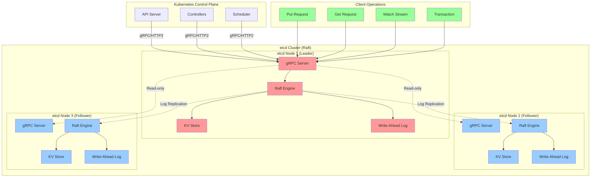

# 5.1 etcd (gRPC) - Raft-backed Key-Value Store

## Definition

etcd is a distributed, reliable key-value store that serves as the backbone of Kubernetes cluster state management. Built on the Raft consensus algorithm, etcd provides strong consistency guarantees and fault tolerance for critical cluster data. It exposes a gRPC API for high-performance, type-safe communication, making it the de facto standard for distributed coordination in cloud-native environments.

etcd stores all Kubernetes objects (pods, services, deployments, etc.) as key-value pairs, with automatic leader election, log replication, and cluster membership management. The gRPC interface provides efficient binary serialization, HTTP/2 multiplexing, and streaming capabilities essential for real-time cluster operations.

## Core RFC References

- **Raft Consensus Algorithm**: [Raft Paper](https://raft.github.io/raft.pdf) - Understandable distributed consensus
- **gRPC Protocol**: [gRPC Specification](https://grpc.io/docs/what-is-grpc/core-concepts/) - High-performance RPC framework
- **HTTP/2**: RFC 9113 - Binary protocol underlying gRPC transport
- **etcd API v3**: [etcd API Reference](https://etcd.io/docs/v3.5/learning/api/) - Key-value operations and watch streams

## Why It Matters

etcd is the **single source of truth** for Kubernetes clusters, making its reliability and performance critical for:

- **Cluster State Management**: All Kubernetes resources stored as consistent key-value data
- **Service Discovery**: Dynamic registration and discovery of cluster services
- **Configuration Management**: Centralized storage for application and system configuration
- **Leader Election**: Coordination of distributed components (controllers, schedulers)
- **Watch Streams**: Real-time notifications for state changes across the cluster

Without etcd, Kubernetes cannot function - it's the persistent brain of every cluster.

## Real-World Engineering Scenario

**Scenario**: You're designing a multi-region Kubernetes platform for a fintech company processing millions of transactions daily. The platform requires:

- **High Availability**: Zero downtime during node failures or network partitions
- **Strong Consistency**: Financial data must never be inconsistent across regions
- **Real-time Updates**: Trading algorithms need instant notification of market data changes
- **Audit Compliance**: Complete transaction history for regulatory requirements

**etcd Architecture Design**:

```
┌─────────────────────────────────────────────────────────────┐
│                    Multi-Region etcd Cluster               │
├─────────────────────────────────────────────────────────────┤
│  Region A (Primary)     │  Region B (DR)     │  Region C   │
│  ┌─────┐ ┌─────┐ ┌─────┐│ ┌─────┐ ┌─────┐   │ ┌─────┐     │
│  │etcd1│ │etcd2│ │etcd3││ │etcd4│ │etcd5│   │ │etcd6│     │
│  │Lead │ │Foll │ │Foll ││ │Foll │ │Foll │   │ │Foll │     │
│  └─────┘ └─────┘ └─────┘│ └─────┘ └─────┘   │ └─────┘     │
│     ▲       ▲       ▲   │    ▲       ▲      │    ▲        │
│     │       │       │   │    │       │      │    │        │
│  ┌─────────────────────┐│ ┌─────────────┐   │ ┌─────┐     │
│  │   K8s API Servers   ││ │ K8s API Srv │   │ │K8s  │     │
│  └─────────────────────┘│ └─────────────┘   │ └─────┘     │
└─────────────────────────────────────────────────────────────┘
```

**Engineering Challenges Solved**:
1. **Split-brain Prevention**: Raft ensures only one leader across all regions
2. **Data Durability**: Write-ahead logging with fsync guarantees
3. **Network Partition Tolerance**: Majority quorum (4/6 nodes) maintains availability
4. **Performance Optimization**: gRPC connection pooling and request batching
5. **Security**: mTLS authentication between all etcd nodes and API servers

## etcd gRPC Architecture



## Key Technical Concepts

### Raft Consensus in etcd
- **Leader Election**: Single leader handles all writes, followers replicate
- **Log Replication**: All operations logged before applying to state machine
- **Safety**: Committed entries never lost, consistent across majority

### gRPC Interface Benefits
- **Type Safety**: Protocol Buffers ensure schema validation
- **Performance**: Binary serialization, HTTP/2 multiplexing
- **Streaming**: Watch API provides real-time change notifications
- **Load Balancing**: Client-side load balancing across etcd nodes

### etcd Operations
- **Put/Get**: Basic key-value operations with optional TTL
- **Watch**: Subscribe to key changes with revision-based consistency
- **Transactions**: ACID transactions with compare-and-swap semantics
- **Leases**: Time-based key expiration for ephemeral data

## Code Examples

Run the etcd gRPC implementation:
```bash
make all
```

This demonstrates:
- etcd cluster setup with Raft consensus
- gRPC client operations (Put, Get, Watch, Transaction)
- Kubernetes-style resource storage and retrieval
- Real-time change notifications via watch streams
- Cluster membership and leader election simulation
