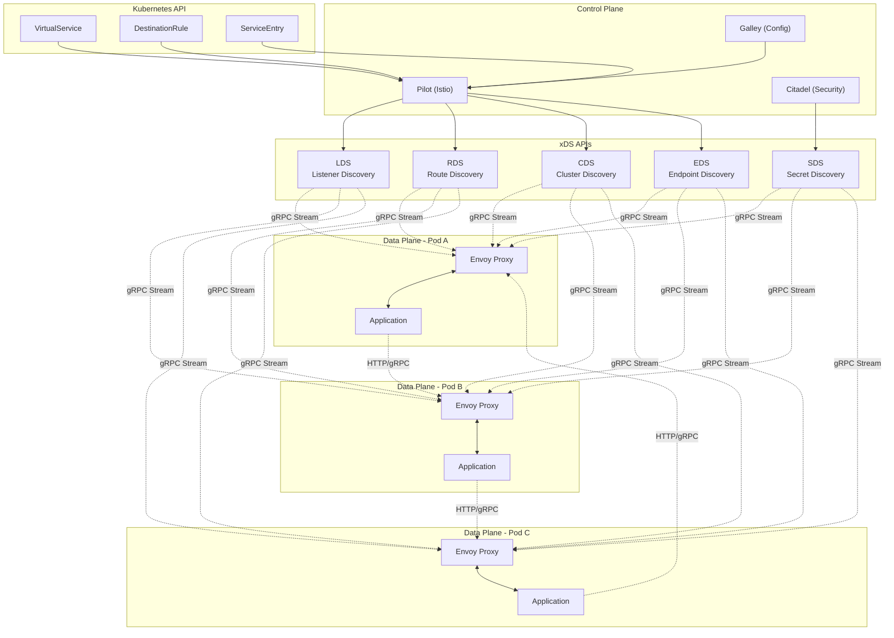

# 6.1 Envoy xDS APIs

## Definition

Envoy xDS (Discovery Service) APIs are a set of gRPC-based protocols that enable dynamic configuration of Envoy proxies in service mesh architectures. The "x" in xDS represents various discovery services: LDS (Listener Discovery Service), RDS (Route Discovery Service), CDS (Cluster Discovery Service), EDS (Endpoint Discovery Service), and SDS (Secret Discovery Service). These APIs allow control planes like Istio, Consul Connect, and AWS App Mesh to dynamically configure Envoy proxies without requiring restarts, enabling zero-downtime updates and sophisticated traffic management.

The xDS protocol follows an eventually consistent model where Envoy proxies subscribe to configuration updates from a management server. This architecture separates the data plane (Envoy proxies handling traffic) from the control plane (management servers providing configuration), enabling centralized policy enforcement and traffic routing decisions across distributed microservices.

## Core RFC References

- **Envoy xDS Protocol**: [Envoy v3 API Reference](https://www.envoyproxy.io/docs/envoy/latest/api-docs/xds_protocol)
- **gRPC Streaming**: RFC 7540 (HTTP/2) for bidirectional streaming
- **Protocol Buffers**: [Google Protocol Buffers Language Guide](https://developers.google.com/protocol-buffers/docs/proto3)
- **Service Mesh Interface**: [SMI Specification](https://smi-spec.io/) for standardized service mesh APIs
- **Envoy Configuration**: [Envoy v3 Configuration Reference](https://www.envoyproxy.io/docs/envoy/latest/configuration/configuration)

## Why It Matters

Envoy xDS APIs are fundamental to modern service mesh architectures and cloud-native applications. They enable:

**Dynamic Configuration Management**: Unlike traditional load balancers requiring manual configuration changes, xDS allows real-time updates to routing rules, health checks, and security policies without service interruption.

**Zero-Downtime Deployments**: Services can be gradually rolled out with sophisticated traffic splitting (canary deployments, blue-green deployments) managed entirely through xDS configuration updates.

**Observability and Security**: xDS enables dynamic injection of observability tools (tracing, metrics collection) and security policies (mTLS, authorization rules) across the entire service mesh.

**Multi-Cloud and Hybrid Architectures**: xDS provides a unified control plane interface that works across different infrastructure providers, enabling consistent traffic management in complex deployment scenarios.

## Real-World Engineering Scenario

**Scenario**: You're architecting a microservices platform for a fintech company processing millions of transactions daily. The platform runs across multiple Kubernetes clusters in different regions, with strict requirements for security, observability, and zero-downtime deployments.

**Challenge**: Traditional approaches using static load balancer configurations create operational overhead and deployment risks. Manual configuration changes for new services, security policies, and traffic routing rules slow down development velocity and increase the risk of configuration errors that could impact financial transactions.

**Solution Architecture**:

1. **Control Plane**: Deploy Istio control plane with Pilot managing xDS configuration distribution
2. **Data Plane**: Envoy sidecars in each pod receiving dynamic configuration via xDS APIs
3. **Configuration Sources**: Kubernetes CRDs (VirtualService, DestinationRule) translated to xDS by Pilot
4. **Observability**: Dynamic injection of Jaeger tracing and Prometheus metrics collection
5. **Security**: Automatic mTLS certificate distribution and policy enforcement via SDS

**Implementation Benefits**:
- **Canary Deployments**: Gradually shift 1% → 10% → 50% → 100% of traffic to new service versions
- **Circuit Breaking**: Automatically isolate failing services to prevent cascade failures
- **Geographic Routing**: Route transactions to the nearest data center for latency optimization
- **Compliance**: Enforce encryption and audit logging for all financial data flows
- **Incident Response**: Instantly reroute traffic during outages without code deployments

This architecture enables the engineering team to deploy new features multiple times per day while maintaining the reliability and security standards required for financial services.

## Architecture



## Key Technical Concepts

### xDS Protocol Flow

**1. Subscription Model**: Envoy proxies establish gRPC streams to the management server and subscribe to specific resource types (listeners, routes, clusters, endpoints, secrets).

**2. Resource Versioning**: Each configuration update includes a version number, enabling Envoy to track configuration state and handle out-of-order updates gracefully.

**3. ACK/NACK Protocol**: Envoy acknowledges successful configuration updates (ACK) or rejects invalid configurations (NACK), providing feedback to the control plane.

**4. Incremental Updates**: xDS supports both full-state snapshots and incremental delta updates, optimizing bandwidth usage in large deployments.

### Discovery Service Types

**Listener Discovery Service (LDS)**: Configures network listeners (ports, protocols, filter chains) that define how Envoy accepts incoming connections.

**Route Discovery Service (RDS)**: Defines HTTP routing rules, including path matching, header manipulation, traffic splitting, and retry policies.

**Cluster Discovery Service (CDS)**: Configures upstream service clusters, including load balancing algorithms, health checking, and circuit breaker settings.

**Endpoint Discovery Service (EDS)**: Provides real-time endpoint information (IP addresses, ports, health status) for service discovery integration.

**Secret Discovery Service (SDS)**: Distributes TLS certificates and private keys for secure communication, enabling automatic certificate rotation.

### Configuration Hierarchy

```
Listeners (LDS)
├── Filter Chains
│   ├── HTTP Connection Manager
│   │   └── Routes (RDS)
│   │       ├── Route Rules
│   │       └── Clusters (CDS)
│   │           └── Endpoints (EDS)
│   └── TLS Context (SDS)
└── Access Logs
```

## Protocol Dependencies

**gRPC (Chapter 2.6)**: xDS APIs use gRPC for efficient bidirectional streaming between control plane and data plane components.

**Kubernetes API (Chapter 5.2)**: Service mesh control planes integrate with Kubernetes APIs to discover services and translate high-level policies into xDS configuration.

**TLS (Chapter 2.8)**: SDS relies on TLS certificate management for secure service-to-service communication.

**HTTP/2 (Chapter 2.3)**: gRPC streams use HTTP/2 multiplexing for efficient configuration distribution to thousands of Envoy proxies.

## Performance Characteristics

**Latency**: Configuration updates typically propagate to Envoy proxies within 100-500ms in well-tuned deployments.

**Scalability**: Single xDS management server can handle 10,000+ Envoy proxy connections with proper resource allocation.

**Bandwidth**: Incremental xDS updates minimize network overhead, typically requiring <1KB per configuration change.

**Memory**: Envoy proxy memory usage scales with configuration complexity, typically 50-200MB for moderate service mesh deployments.

## Security Considerations

**Control Plane Security**: xDS management servers must be secured with strong authentication and authorization to prevent unauthorized configuration changes.

**Certificate Management**: SDS enables automatic certificate rotation but requires secure certificate authority integration and proper key management.

**Configuration Validation**: Invalid xDS configurations can disrupt service communication, requiring robust validation and rollback mechanisms.

**Audit Logging**: All configuration changes should be logged for compliance and debugging purposes.

## Common Implementation Patterns

### Gradual Traffic Shifting

```yaml
# VirtualService for canary deployment
apiVersion: networking.istio.io/v1alpha3
kind: VirtualService
metadata:
  name: payment-service
spec:
  http:
  - match:
    - headers:
        canary:
          exact: "true"
    route:
    - destination:
        host: payment-service
        subset: v2
  - route:
    - destination:
        host: payment-service
        subset: v1
      weight: 90
    - destination:
        host: payment-service
        subset: v2
      weight: 10
```

### Circuit Breaking Configuration

```yaml
# DestinationRule with circuit breaker
apiVersion: networking.istio.io/v1alpha3
kind: DestinationRule
metadata:
  name: payment-service
spec:
  host: payment-service
  trafficPolicy:
    outlierDetection:
      consecutiveErrors: 3
      interval: 30s
      baseEjectionTime: 30s
    connectionPool:
      tcp:
        maxConnections: 100
      http:
        http1MaxPendingRequests: 50
        maxRequestsPerConnection: 10
```

### Multi-Cluster Service Discovery

```yaml
# ServiceEntry for external service
apiVersion: networking.istio.io/v1alpha3
kind: ServiceEntry
metadata:
  name: external-payment-gateway
spec:
  hosts:
  - payment.external.com
  ports:
  - number: 443
    name: https
    protocol: HTTPS
  location: MESH_EXTERNAL
  resolution: DNS
```

## Integration with Kubernetes

xDS APIs integrate deeply with Kubernetes through Custom Resource Definitions (CRDs) that provide declarative configuration:

- **VirtualService**: HTTP traffic routing and manipulation
- **DestinationRule**: Load balancing, circuit breaking, TLS settings
- **Gateway**: Ingress and egress traffic configuration
- **ServiceEntry**: External service registration
- **PeerAuthentication**: mTLS policy configuration
- **AuthorizationPolicy**: Access control rules

These high-level Kubernetes resources are automatically translated into low-level xDS configuration by the service mesh control plane, enabling developers to manage complex traffic policies using familiar Kubernetes tooling.

## Debugging and Troubleshooting

**Configuration Dump**: Envoy provides admin endpoints to inspect current xDS configuration state.

**Access Logs**: Detailed request logging helps identify routing and policy issues.

**Metrics**: Envoy exposes comprehensive metrics for monitoring xDS update success rates and configuration health.

**Distributed Tracing**: Integration with Jaeger/Zipkin provides end-to-end request visibility across the service mesh.

The xDS protocol represents a fundamental shift from static infrastructure configuration to dynamic, policy-driven service mesh management, enabling the operational agility required for modern cloud-native applications.
