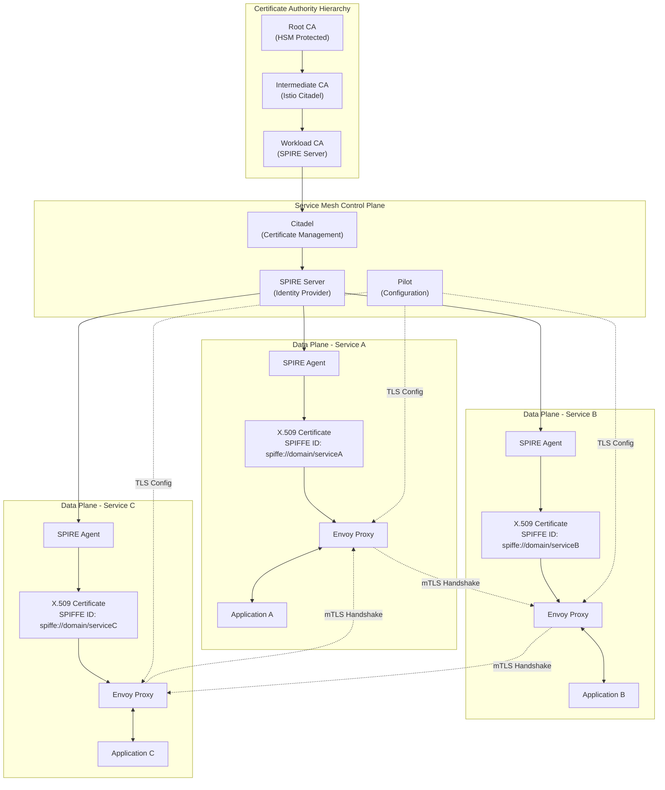

# 6.2 Mutual TLS (mTLS)

## Definition

Mutual TLS (mTLS) is a security protocol that extends traditional TLS by requiring both the client and server to authenticate each other using X.509 certificates. Unlike standard TLS where only the server presents a certificate, mTLS establishes bidirectional authentication, ensuring that both parties in a communication channel can verify each other's identity. This creates a zero-trust security model where every service-to-service communication is encrypted and authenticated.

In service mesh architectures, mTLS is automatically implemented at the sidecar proxy level (typically Envoy), providing transparent encryption and authentication for all inter-service communication without requiring application code changes. The service mesh control plane manages certificate lifecycle, including issuance, rotation, and revocation, enabling secure communication across distributed microservices.

## Core RFC References

- **TLS 1.3**: RFC 8446 - The Transport Layer Security (TLS) Protocol Version 1.3
- **TLS 1.2**: RFC 5246 - The Transport Layer Security (TLS) Protocol Version 1.2
- **X.509 Certificates**: RFC 5280 - Internet X.509 Public Key Infrastructure Certificate and Certificate Revocation List (CRL) Profile
- **PKCS #10**: RFC 2986 - Certification Request Syntax Specification
- **Certificate Transparency**: RFC 6962 - Certificate Transparency for monitoring and auditing certificates
- **SPIFFE**: [SPIFFE Specification](https://spiffe.io/docs/latest/spiffe-about/spiffe-concepts/) - Secure Production Identity Framework for Everyone

## Why It Matters

Mutual TLS is critical for modern cloud-native security architectures and zero-trust networking models:

**Zero-Trust Security**: mTLS eliminates the traditional network perimeter security model by ensuring that every service communication is authenticated and encrypted, regardless of network location.

**Compliance and Governance**: Many regulatory frameworks (SOC 2, PCI DSS, HIPAA) require encryption in transit and strong authentication for sensitive data flows, which mTLS provides automatically.

**Service Identity and Authorization**: mTLS certificates embed service identity information (SPIFFE IDs), enabling fine-grained authorization policies based on cryptographically verified service identities.

**Defense in Depth**: Even if network security is compromised, mTLS ensures that attackers cannot intercept or manipulate service communications without valid certificates.

## Real-World Engineering Scenario

**Scenario**: You're designing a financial trading platform that processes millions of transactions per second across multiple data centers. The platform consists of 200+ microservices handling order processing, risk management, settlement, and regulatory reporting. Due to financial regulations and the sensitive nature of trading data, every service communication must be encrypted and authenticated.

**Challenge**: Traditional approaches using API keys or shared secrets create operational overhead and security risks. Manual certificate management for 200+ services across multiple environments (dev, staging, production) is error-prone and doesn't scale. Network-level security alone is insufficient for regulatory compliance.

**Solution Architecture**:

1. **Service Mesh with Automatic mTLS**: Deploy Istio with automatic mTLS enabled for all service communications
2. **Certificate Authority (CA)**: Implement hierarchical CA with root CA in HSM and intermediate CAs for each environment
3. **SPIFFE/SPIRE Integration**: Use SPIFFE IDs for service identity and SPIRE for automatic certificate issuance and rotation
4. **Policy Enforcement**: Implement authorization policies based on service identity and certificate attributes
5. **Observability**: Monitor certificate health, rotation events, and mTLS handshake metrics

**Implementation Benefits**:
- **Automatic Encryption**: All 40,000+ daily service calls are automatically encrypted without code changes
- **Certificate Rotation**: Certificates rotate every 24 hours automatically, reducing long-term key exposure
- **Regulatory Compliance**: Meets SOX, PCI DSS, and MiFID II requirements for data protection in transit
- **Zero-Trust Architecture**: Services can communicate securely across data centers and cloud providers
- **Incident Response**: Certificate-based identity enables precise access revocation during security incidents
- **Audit Trail**: Complete cryptographic audit trail for all service communications

This architecture enables the trading platform to maintain the highest security standards while supporting rapid development and deployment of new trading algorithms and risk management features.

## Architecture



## Key Technical Concepts

### mTLS Handshake Process

**1. Client Hello**: Client initiates TLS handshake with supported cipher suites and extensions
**2. Server Hello + Certificate**: Server responds with its certificate and requests client certificate
**3. Client Certificate**: Client presents its X.509 certificate for authentication
**4. Certificate Verification**: Both parties verify each other's certificates against trusted CA
**5. Key Exchange**: Establish shared encryption keys using certificate public/private key pairs
**6. Finished**: Both parties confirm successful mutual authentication and begin encrypted communication

### Certificate Lifecycle Management

**Certificate Issuance**: Automated certificate generation based on service identity and policy
**Certificate Rotation**: Periodic renewal of certificates (typically every 24-48 hours in production)
**Certificate Revocation**: Immediate invalidation of compromised certificates via CRL or OCSP
**Certificate Validation**: Real-time verification of certificate validity, expiration, and revocation status

### SPIFFE/SPIRE Integration

**SPIFFE ID**: Unique service identity in URI format (e.g., `spiffe://trust-domain/path/service-name`)
**SPIRE Server**: Central identity provider that issues and manages SPIFFE identities
**SPIRE Agent**: Node-level agent that attests workload identity and delivers certificates
**Workload API**: gRPC API for workloads to retrieve certificates and trust bundles

### Service Mesh mTLS Modes

**STRICT Mode**: All communications must use mTLS; plaintext connections are rejected
**PERMISSIVE Mode**: Both mTLS and plaintext connections are allowed (migration mode)
**DISABLE Mode**: mTLS is disabled; only plaintext connections are used

## Protocol Dependencies

**TLS (Chapter 2.8)**: mTLS extends TLS with bidirectional certificate authentication
**X.509 PKI**: Certificate format and validation procedures for service identity
**gRPC (Chapter 2.7)**: SPIRE Workload API uses gRPC for certificate distribution
**Envoy xDS (Chapter 6.1)**: SDS (Secret Discovery Service) distributes certificates to Envoy proxies

## Performance Characteristics

**Handshake Latency**: mTLS adds 1-2ms latency for initial connection establishment
**CPU Overhead**: Certificate verification adds ~5-10% CPU overhead compared to plaintext
**Memory Usage**: Certificate storage requires ~1-2KB per active connection
**Throughput Impact**: Minimal impact on sustained connections due to TLS session reuse

## Security Considerations

**Certificate Authority Security**: Root CA private keys must be protected in HSMs or secure enclaves
**Certificate Rotation**: Short certificate lifetimes (24-48 hours) limit exposure from compromised keys
**Revocation Handling**: Implement efficient certificate revocation checking (OCSP stapling)
**Key Management**: Secure storage and handling of private keys at the workload level
**Trust Domain Isolation**: Separate trust domains for different environments and security zones

## Common Implementation Patterns

### Automatic mTLS with Istio

```yaml
# PeerAuthentication for strict mTLS
apiVersion: security.istio.io/v1beta1
kind: PeerAuthentication
metadata:
  name: default
  namespace: production
spec:
  mtls:
    mode: STRICT
---
# DestinationRule for mTLS client configuration
apiVersion: networking.istio.io/v1alpha3
kind: DestinationRule
metadata:
  name: default
  namespace: production
spec:
  host: "*.local"
  trafficPolicy:
    tls:
      mode: ISTIO_MUTUAL
```

### Certificate-based Authorization

```yaml
# AuthorizationPolicy based on certificate identity
apiVersion: security.istio.io/v1beta1
kind: AuthorizationPolicy
metadata:
  name: payment-service-authz
  namespace: production
spec:
  selector:
    matchLabels:
      app: payment-service
  rules:
  - from:
    - source:
        principals: ["cluster.local/ns/production/sa/order-service"]
    to:
    - operation:
        methods: ["POST"]
        paths: ["/api/payments"]
```

### SPIFFE Identity Configuration

```yaml
# SPIRE Server Configuration
apiVersion: v1
kind: ConfigMap
metadata:
  name: spire-server
data:
  server.conf: |
    server {
      bind_address = "0.0.0.0"
      bind_port = "8081"
      trust_domain = "example.org"
      data_dir = "/run/spire/data"
      log_level = "DEBUG"
      ca_subject = {
        country = ["US"],
        organization = ["SPIFFE"],
        common_name = "SPIRE Server CA",
      }
    }
    
    plugins {
      DataStore "sql" {
        plugin_data {
          database_type = "sqlite3"
          connection_string = "/run/spire/data/datastore.sqlite3"
        }
      }
      
      NodeAttestor "k8s_sat" {
        plugin_data {
          clusters = {
            "production" = {
              service_account_allow_list = ["spire:spire-agent"]
            }
          }
        }
      }
      
      WorkloadAttestor "k8s" {
        plugin_data {
          skip_kubelet_verification = true
        }
      }
    }
```

## Integration with Service Mesh

mTLS in service mesh environments provides several key capabilities:

**Transparent Security**: Applications communicate over plaintext HTTP while Envoy proxies handle mTLS automatically
**Policy Enforcement**: Authorization policies based on cryptographically verified service identity
**Observability**: Detailed metrics on certificate health, handshake success rates, and authentication failures
**Gradual Migration**: Permissive mode allows gradual migration from plaintext to mTLS

## Certificate Monitoring and Alerting

**Certificate Expiration**: Monitor certificate expiration times and alert before rotation deadlines
**Handshake Failures**: Track mTLS handshake failures and certificate validation errors
**CA Health**: Monitor certificate authority availability and signing operations
**Rotation Events**: Log and audit all certificate rotation and renewal events

## Debugging and Troubleshooting

**Certificate Validation**: Use `openssl` commands to verify certificate chains and validity
**TLS Handshake Analysis**: Capture and analyze TLS handshake packets with Wireshark
**Envoy Admin Interface**: Inspect certificate status and TLS configuration via Envoy admin endpoints
**SPIRE Debugging**: Use SPIRE CLI tools to verify workload identity and certificate issuance

## Performance Optimization

**Session Resumption**: Enable TLS session resumption to avoid repeated handshakes
**Certificate Caching**: Cache validated certificates to reduce verification overhead
**Hardware Acceleration**: Use hardware-accelerated cryptography for high-throughput scenarios
**Connection Pooling**: Maintain persistent connections to amortize handshake costs

mTLS represents a fundamental shift toward zero-trust security architectures, providing the cryptographic foundation for secure service-to-service communication in modern distributed systems. Its automatic implementation in service mesh environments makes enterprise-grade security accessible to development teams without requiring deep cryptographic expertise.
