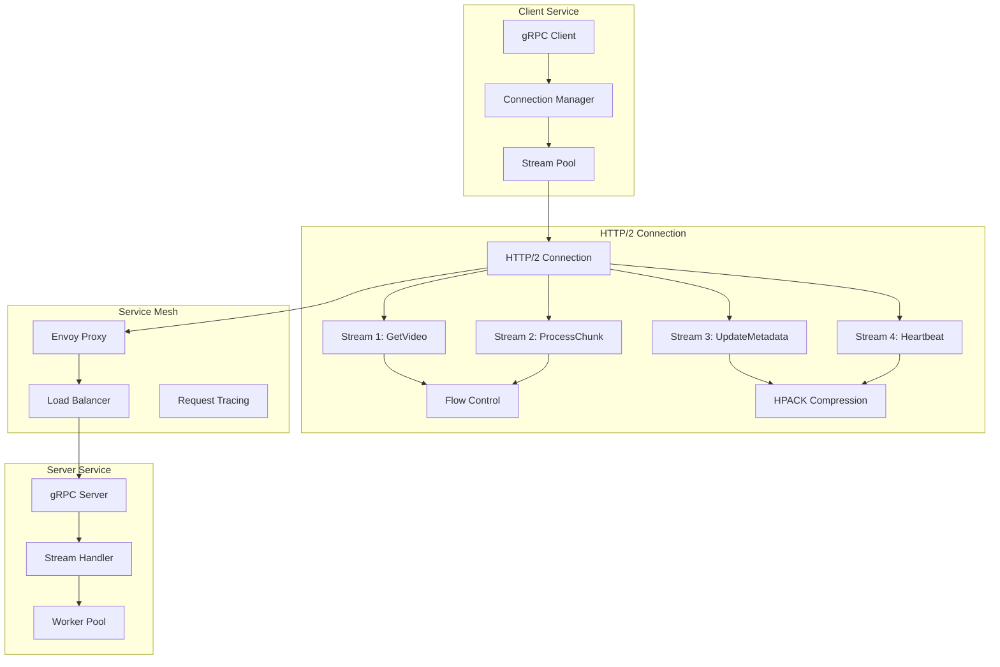

# HTTP/2 & gRPC Multiplexing

## Definition

HTTP/2 & gRPC multiplexing enables efficient concurrent communication over a single connection by interleaving multiple streams. In Kubernetes service mesh environments, this allows services to handle thousands of concurrent requests without connection overhead, dramatically improving performance and resource utilization.

**Core RFCs:**
- RFC 7540: HTTP/2 Protocol
- RFC 7541: HPACK Header Compression for HTTP/2
- gRPC Protocol: Built on HTTP/2 with Protocol Buffers

## Real-World Engineering Scenario

You're architecting a high-throughput microservices platform for a streaming media company. The platform handles:

- **Video Processing Pipeline**: 50+ microservices processing video chunks
- **Real-time Analytics**: Streaming telemetry from 10,000+ edge nodes  
- **Content Delivery**: Dynamic content routing across global regions
- **Live Streaming**: Low-latency bidirectional communication for live events

Traditional HTTP/1.1 creates connection bottlenecks. Each service needs hundreds of concurrent connections, exhausting connection pools and creating head-of-line blocking. HTTP/2 multiplexing solves this by enabling unlimited concurrent streams over a single connection.

## Architecture



## Key Technical Concepts

### HTTP/2 Stream Multiplexing

**Stream Lifecycle:**
1. **Stream Creation**: Client initiates stream with HEADERS frame
2. **Data Transfer**: DATA frames carry request/response payloads
3. **Flow Control**: WINDOW_UPDATE frames manage backpressure
4. **Stream Closure**: RST_STREAM or END_STREAM flags terminate streams

**Stream States:**
- `idle` → `open` → `half-closed` → `closed`
- `idle` → `reserved` → `half-closed` → `closed`

**Frame Types:**
- **HEADERS**: Request/response headers with HPACK compression
- **DATA**: Request/response body payload
- **WINDOW_UPDATE**: Flow control updates
- **RST_STREAM**: Stream termination
- **SETTINGS**: Connection-level configuration
- **PING**: Connection health checks

### gRPC Stream Types

**Unary RPC:**
```protobuf
rpc GetVideo(VideoRequest) returns (VideoResponse);
```

**Server Streaming:**
```protobuf
rpc StreamChunks(VideoRequest) returns (stream VideoChunk);
```

**Client Streaming:**
```protobuf
rpc UploadVideo(stream VideoChunk) returns (UploadResponse);
```

**Bidirectional Streaming:**
```protobuf
rpc ProcessLiveStream(stream LiveFrame) returns (stream ProcessedFrame);
```

### Flow Control Mechanisms

**Connection-Level Flow Control:**
- Global window size for entire connection
- Prevents fast sender from overwhelming receiver
- WINDOW_UPDATE frames increase available window

**Stream-Level Flow Control:**
- Individual window per stream
- Independent backpressure per request
- Allows prioritization of critical streams

**gRPC Flow Control:**
- Built on HTTP/2 flow control
- Application-level backpressure
- Automatic window management

### Header Compression (HPACK)

**Static Table**: Pre-defined common headers
**Dynamic Table**: Connection-specific header cache
**Huffman Encoding**: Compression of header values

Benefits:
- 85% reduction in header size
- Eliminates redundant header transmission
- Maintains security against CRIME attacks

## Protocol Dependencies

**Builds on Previous Chapters:**
- **Chapter 2.4 (HTTP/2)**: Core HTTP/2 protocol mechanics
- **Chapter 2.7 (gRPC)**: gRPC framework and Protocol Buffers
- **Chapter 1.3 (TCP)**: Underlying reliable transport
- **Chapter 2.3 (TLS)**: Encryption and security (HTTP/2 over TLS)

**Integration Points:**
- **Envoy Proxy**: HTTP/2 termination and load balancing
- **Kubernetes Services**: Service discovery and routing
- **Service Mesh**: Traffic management and observability

## Performance Characteristics

### Multiplexing Benefits

**Connection Efficiency:**
- Single connection vs. multiple HTTP/1.1 connections
- Reduced TCP handshake overhead
- Lower memory footprint per connection

**Latency Improvements:**
- No head-of-line blocking at HTTP level
- Concurrent request processing
- Stream prioritization for critical requests

**Throughput Gains:**
- Better bandwidth utilization
- Reduced connection establishment time
- Efficient header compression

### Performance Metrics

**Stream Concurrency:**
- Default: 100 concurrent streams per connection
- Configurable via SETTINGS_MAX_CONCURRENT_STREAMS
- Production: Often 1000+ streams per connection

**Flow Control Windows:**
- Default: 65,535 bytes per stream
- Connection window: 65,535 bytes initially
- Auto-tuning based on bandwidth-delay product

**Header Compression Ratio:**
- Typical: 85-90% size reduction
- Dynamic table size: 4,096 bytes default
- Huffman encoding: Additional 20-30% compression

## Security Considerations

### TLS Integration

**HTTP/2 over TLS (h2):**
- Mandatory for browser implementations
- ALPN negotiation for protocol selection
- Perfect Forward Secrecy with ephemeral keys

**Plaintext HTTP/2 (h2c):**
- Allowed for internal service communication
- Connection upgrade from HTTP/1.1
- Prior knowledge direct connection

### gRPC Security

**Transport Security:**
- TLS 1.2+ for encryption in transit
- Certificate-based authentication
- mTLS for service-to-service auth

**Application Security:**
- Authentication metadata in headers
- Authorization via interceptors
- Request/response validation

### Attack Vectors

**Stream Exhaustion:**
- Mitigation: SETTINGS_MAX_CONCURRENT_STREAMS
- Rate limiting at proxy level
- Connection-level limits

**Flow Control Attacks:**
- Small window updates causing starvation
- Mitigation: Minimum window thresholds
- Timeout-based stream cleanup

**Header Compression Attacks:**
- Dynamic table poisoning
- Mitigation: Table size limits
- Header value validation

## Common Implementation Patterns

### Connection Pooling

**gRPC Channel Management:**
```python
# Connection pool with multiple channels
class GRPCConnectionPool:
    def __init__(self, target, pool_size=4):
        self.channels = [
            grpc.insecure_channel(target) 
            for _ in range(pool_size)
        ]
        self.current = 0
    
    def get_channel(self):
        channel = self.channels[self.current]
        self.current = (self.current + 1) % len(self.channels)
        return channel
```

### Stream Management

**Bidirectional Streaming:**
```python
async def process_live_stream(self, request_iterator):
    async for request in request_iterator:
        # Process incoming frame
        processed = await self.process_frame(request)
        yield processed
        
        # Apply backpressure if needed
        if self.should_apply_backpressure():
            await asyncio.sleep(0.01)
```

### Load Balancing

**Client-Side Load Balancing:**
- Round-robin across multiple channels
- Health-aware endpoint selection
- Automatic failover and retry

**Proxy-Level Load Balancing:**
- Envoy HTTP/2 connection pooling
- Least-request load balancing
- Circuit breaker integration

## Integration with Service Mesh

### Envoy Proxy Configuration

**HTTP/2 Settings:**
```yaml
http2_protocol_options:
  max_concurrent_streams: 1000
  initial_stream_window_size: 268435456  # 256MB
  initial_connection_window_size: 268435456
  allow_connect: true
  allow_metadata: true
```

**gRPC Route Configuration:**
```yaml
routes:
- match:
    grpc: {}
  route:
    cluster: video-processing-service
    timeout: 30s
    retry_policy:
      retry_on: "5xx,reset,connect-failure,refused-stream"
      num_retries: 3
```

### Observability

**Metrics Collection:**
- Stream count and duration
- Flow control window utilization
- Header compression ratios
- Request/response latencies

**Distributed Tracing:**
- gRPC interceptors for trace propagation
- HTTP/2 stream correlation
- Cross-service request tracking

**Health Checks:**
- gRPC health checking protocol
- HTTP/2 PING frames for liveness
- Circuit breaker status monitoring

## Debugging and Troubleshooting

### Common Issues

**Stream Starvation:**
- Symptoms: Some streams never complete
- Cause: Aggressive flow control or prioritization
- Solution: Tune window sizes and priorities

**Connection Pooling Problems:**
- Symptoms: High connection count
- Cause: Inefficient channel management
- Solution: Implement proper connection pooling

**Header Compression Issues:**
- Symptoms: High CPU usage or memory leaks
- Cause: Dynamic table management problems
- Solution: Monitor table size and turnover

### Debugging Tools

**gRPC Debugging:**
```bash
# Enable gRPC debug logging
export GRPC_VERBOSITY=debug
export GRPC_TRACE=all

# Use grpcurl for testing
grpcurl -plaintext localhost:9090 list
grpcurl -plaintext localhost:9090 VideoService/GetVideo
```

**HTTP/2 Analysis:**
- Wireshark HTTP/2 dissector
- Chrome DevTools Protocol tab
- Envoy admin interface statistics

**Performance Profiling:**
- gRPC channelz for channel state
- HTTP/2 frame analysis
- Flow control window monitoring

## Best Practices

### Connection Management
- Use connection pooling for high-throughput services
- Configure appropriate stream limits
- Implement graceful connection shutdown

### Stream Handling
- Design for concurrent stream processing
- Implement proper flow control
- Use streaming for large data transfers

### Error Handling
- Implement retry logic with exponential backoff
- Use circuit breakers for fault tolerance
- Handle stream resets gracefully

### Performance Optimization
- Tune flow control windows for your workload
- Use header compression effectively
- Monitor and optimize stream concurrency

## Run the Code

```bash
# Run HTTP/2 multiplexing demonstration
make http2-multiplexing

# Run gRPC streaming examples
make grpc-streaming

# Generate performance comparison diagrams
make diagrams

# Run comprehensive tests
make test
```

This implementation demonstrates HTTP/2 stream multiplexing and gRPC streaming patterns essential for high-performance service mesh communication, enabling efficient concurrent processing and optimal resource utilization in Kubernetes environments.
