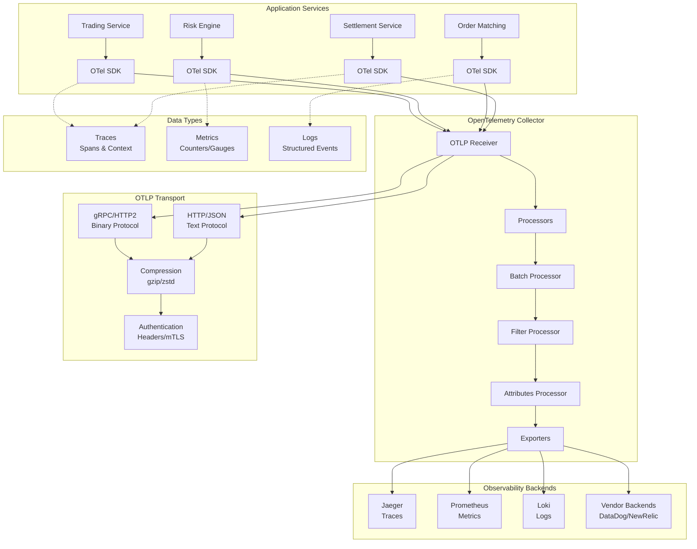

# OpenTelemetry Protocol (OTLP)

## Definition

OpenTelemetry Protocol (OTLP) is the native telemetry data exchange protocol for OpenTelemetry, enabling efficient transmission of traces, metrics, and logs from applications to observability backends. In Kubernetes service mesh environments, OTLP provides standardized observability data collection across distributed microservices with minimal overhead and maximum interoperability.

**Core Specifications:**
- OTLP Specification v1.0+: Protocol definition and data models
- OpenTelemetry Semantic Conventions: Standardized attribute naming
- gRPC and HTTP/JSON transport bindings
- Protocol Buffers schema definitions

## Real-World Engineering Scenario

You're building observability infrastructure for a financial trading platform with:

- **High-Frequency Trading**: 100,000+ transactions per second requiring sub-millisecond latency
- **Distributed Architecture**: 200+ microservices across multiple regions
- **Regulatory Compliance**: Full audit trails and transaction tracing required
- **Real-time Monitoring**: Immediate detection of performance anomalies
- **Multi-Cloud Deployment**: Services spanning AWS, GCP, and on-premises

Traditional observability solutions create performance bottlenecks and vendor lock-in. OTLP enables standardized telemetry collection with efficient batching, compression, and transport, ensuring minimal impact on trading performance while providing comprehensive observability.

## Architecture



## Key Technical Concepts

### OTLP Data Model

**Resource Attributes:**
- Service identification (name, version, instance)
- Infrastructure metadata (host, container, k8s pod)
- Environment context (deployment, namespace)

**Instrumentation Scope:**
- Library name and version generating telemetry
- Schema URL for semantic conventions
- Scope attributes for context

**Telemetry Data Types:**

**Traces:**
```protobuf
message Span {
  bytes trace_id = 1;
  bytes span_id = 2;
  bytes parent_span_id = 3;
  string name = 4;
  SpanKind kind = 5;
  uint64 start_time_unix_nano = 6;
  uint64 end_time_unix_nano = 7;
  repeated KeyValue attributes = 8;
  Status status = 9;
}
```

**Metrics:**
```protobuf
message Metric {
  string name = 1;
  string description = 2;
  string unit = 3;
  oneof data {
    Gauge gauge = 4;
    Sum sum = 5;
    Histogram histogram = 6;
    ExponentialHistogram exponential_histogram = 7;
    Summary summary = 8;
  }
}
```

**Logs:**
```protobuf
message LogRecord {
  uint64 time_unix_nano = 1;
  SeverityNumber severity_number = 2;
  string severity_text = 3;
  AnyValue body = 4;
  repeated KeyValue attributes = 5;
  bytes trace_id = 6;
  bytes span_id = 7;
}
```

### Transport Protocols

**gRPC Transport (Recommended):**
- Binary Protocol Buffers encoding
- HTTP/2 multiplexing and flow control
- Bidirectional streaming support
- Built-in compression and authentication

**HTTP/JSON Transport:**
- RESTful HTTP/1.1 or HTTP/2
- JSON encoding for human readability
- Simpler firewall traversal
- Browser and curl compatibility

### Batching and Compression

**Batch Processing:**
- Configurable batch size and timeout
- Reduces network overhead and latency
- Improves throughput for high-volume telemetry

**Compression Options:**
- gzip: Universal compatibility, moderate compression
- zstd: Higher compression ratio, better performance
- Automatic negotiation via Accept-Encoding

### Authentication and Security

**Authentication Methods:**
- API Key headers
- Bearer token authentication
- mTLS client certificates
- Custom authentication headers

**Transport Security:**
- TLS 1.2+ for encryption in transit
- Certificate validation and pinning
- OTLP over secure gRPC (TLS)

## Protocol Dependencies

**Builds on Previous Chapters:**
- **Chapter 2.7 (gRPC)**: Primary transport mechanism
- **Chapter 2.2 (HTTP/1.1)**: Alternative transport option
- **Chapter 1.3 (TCP)**: Underlying reliable transport
- **Chapter 2.3 (TLS)**: Security and encryption

**Integration Points:**
- **Kubernetes Services**: Service discovery and routing
- **Envoy Proxy**: Telemetry collection and forwarding
- **Service Mesh**: Distributed tracing correlation

## Performance Characteristics

### Throughput and Latency

**High Throughput:**
- 100,000+ spans/second per collector instance
- Efficient binary encoding reduces payload size
- Batching minimizes network round trips

**Low Latency:**
- Sub-millisecond serialization overhead
- Asynchronous export prevents blocking
- Streaming protocols for real-time data

**Resource Efficiency:**
- 60-80% smaller payloads vs JSON
- Minimal CPU overhead for encoding/decoding
- Memory-efficient streaming processing

### Scalability Metrics

**Horizontal Scaling:**
- Stateless collector design
- Load balancing across collector instances
- Partition-based processing for high volume

**Vertical Scaling:**
- Multi-core processing support
- Configurable worker pools
- Memory-mapped I/O for large datasets

**Network Efficiency:**
- Compression ratios: 70-90% size reduction
- Connection pooling and reuse
- Adaptive batching based on load

## Security Considerations

### Data Protection

**Encryption in Transit:**
- TLS 1.2+ mandatory for production
- Certificate-based authentication
- Perfect Forward Secrecy (PFS)

**Data Sanitization:**
- PII scrubbing in processors
- Attribute filtering and redaction
- Configurable data retention policies

### Access Control

**Authentication:**
- Service-to-service authentication
- API key rotation and management
- RBAC integration with Kubernetes

**Authorization:**
- Tenant isolation and multi-tenancy
- Resource-based access control
- Audit logging for compliance

### Privacy and Compliance

**Data Governance:**
- GDPR compliance for EU data
- Data residency requirements
- Retention and deletion policies

**Audit Requirements:**
- Immutable audit trails
- Regulatory reporting capabilities
- Data lineage tracking

## Common Implementation Patterns

### Collector Configuration

**OTLP Receiver:**
```yaml
receivers:
  otlp:
    protocols:
      grpc:
        endpoint: 0.0.0.0:4317
        auth:
          authenticator: oidc
        tls:
          cert_file: /certs/server.crt
          key_file: /certs/server.key
      http:
        endpoint: 0.0.0.0:4318
        cors:
          allowed_origins: ["*"]
```

**Batch Processor:**
```yaml
processors:
  batch:
    timeout: 1s
    send_batch_size: 1024
    send_batch_max_size: 2048
  
  attributes:
    actions:
      - key: environment
        value: production
        action: insert
      - key: sensitive_data
        action: delete
```

**Exporters:**
```yaml
exporters:
  jaeger:
    endpoint: jaeger-collector:14250
    tls:
      insecure: false
  
  prometheus:
    endpoint: "0.0.0.0:8889"
    namespace: trading_platform
    
  otlp/backend:
    endpoint: https://api.vendor.com:443
    headers:
      api-key: ${API_KEY}
```

### SDK Instrumentation

**Auto-Instrumentation:**
```python
from opentelemetry.auto_instrumentation import sitecustomize
from opentelemetry.exporter.otlp.proto.grpc.trace_exporter import OTLPSpanExporter
from opentelemetry.sdk.trace import TracerProvider
from opentelemetry.sdk.trace.export import BatchSpanProcessor

# Configure OTLP exporter
otlp_exporter = OTLPSpanExporter(
    endpoint="http://otel-collector:4317",
    insecure=True,
    compression=gzip.GzipCompression()
)

# Set up batch processing
span_processor = BatchSpanProcessor(
    otlp_exporter,
    max_queue_size=2048,
    max_export_batch_size=512,
    export_timeout_millis=30000
)

provider = TracerProvider()
provider.add_span_processor(span_processor)
```

**Manual Instrumentation:**
```python
from opentelemetry import trace, metrics
from opentelemetry.exporter.otlp.proto.grpc.metric_exporter import OTLPMetricExporter

# Create custom spans
tracer = trace.get_tracer(__name__)
with tracer.start_as_current_span("process_trade") as span:
    span.set_attribute("trade.id", trade_id)
    span.set_attribute("trade.amount", amount)
    span.set_attribute("trade.currency", currency)
    
    # Process trade logic
    result = process_trade(trade_data)
    
    span.set_attribute("trade.status", result.status)
    if result.error:
        span.record_exception(result.error)
        span.set_status(trace.Status(trace.StatusCode.ERROR))
```

## Integration with Service Mesh

### Envoy Integration

**OTLP Access Logs:**
```yaml
access_log:
- name: envoy.access_loggers.open_telemetry
  typed_config:
    "@type": type.googleapis.com/envoy.extensions.access_loggers.open_telemetry.v3.OpenTelemetryAccessLogConfig
    common_config:
      log_name: "envoy_access_log"
      transport_api_version: V3
      grpc_service:
        envoy_grpc:
          cluster_name: otel_collector
```

**Distributed Tracing:**
```yaml
tracing:
  http:
    name: envoy.tracers.opentelemetry
    typed_config:
      "@type": type.googleapis.com/envoy.extensions.tracers.opentelemetry.v3.OpenTelemetryConfig
      grpc_service:
        envoy_grpc:
          cluster_name: otel_collector
      service_name: "trading-gateway"
```

### Kubernetes Deployment

**Collector DaemonSet:**
```yaml
apiVersion: apps/v1
kind: DaemonSet
metadata:
  name: otel-collector
spec:
  selector:
    matchLabels:
      app: otel-collector
  template:
    spec:
      containers:
      - name: otel-collector
        image: otel/opentelemetry-collector-contrib:latest
        ports:
        - containerPort: 4317  # OTLP gRPC
        - containerPort: 4318  # OTLP HTTP
        env:
        - name: GOGC
          value: "80"
        resources:
          limits:
            memory: 512Mi
            cpu: 500m
```

## Observability and Monitoring

### Collector Metrics

**Throughput Metrics:**
- Spans/metrics/logs received per second
- Export success/failure rates
- Queue depth and processing latency

**Resource Metrics:**
- Memory usage and garbage collection
- CPU utilization per processor
- Network I/O and compression ratios

**Health Monitoring:**
```yaml
extensions:
  health_check:
    endpoint: 0.0.0.0:13133
  
  pprof:
    endpoint: 0.0.0.0:1777
  
  zpages:
    endpoint: 0.0.0.0:55679
```

### Debugging and Troubleshooting

**Debug Logging:**
```yaml
service:
  telemetry:
    logs:
      level: debug
      development: true
      encoding: json
```

**Trace Sampling:**
```yaml
processors:
  probabilistic_sampler:
    sampling_percentage: 1.0  # 1% sampling
  
  tail_sampling:
    decision_wait: 10s
    policies:
      - name: error_traces
        type: status_code
        status_code: {status_codes: [ERROR]}
```

## Best Practices

### Performance Optimization
- Use gRPC transport for high-throughput scenarios
- Configure appropriate batch sizes for your workload
- Enable compression for network efficiency
- Implement sampling strategies for high-volume traces

### Reliability
- Deploy collectors in high-availability mode
- Implement circuit breakers and retries
- Use persistent queues for critical telemetry
- Monitor collector health and performance

### Security
- Enable TLS for all OTLP communications
- Implement proper authentication and authorization
- Sanitize sensitive data in processors
- Regular security audits and updates

### Operational Excellence
- Standardize semantic conventions across services
- Implement comprehensive monitoring of collectors
- Automate collector configuration management
- Regular performance testing and capacity planning

## Run the Code

```bash
# Run OTLP collector simulation
make otlp-collector

# Run telemetry data generation
make telemetry-generator

# Generate architecture diagrams
make diagrams

# Run comprehensive tests
make test
```

This implementation demonstrates OpenTelemetry Protocol (OTLP) for standardized observability data collection, enabling efficient telemetry transmission and processing in distributed Kubernetes environments with minimal performance impact and maximum interoperability.
