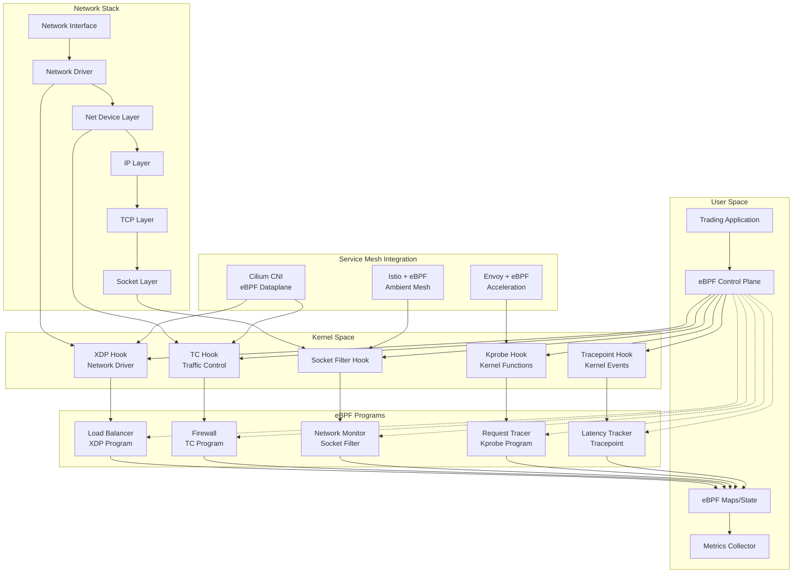

# eBPF-based Protocols

## Definition

eBPF (extended Berkeley Packet Filter) enables programmable, high-performance packet processing and observability directly in the Linux kernel. In Kubernetes service mesh environments, eBPF provides zero-overhead network monitoring, traffic management, and security enforcement without requiring application changes or proxy overhead.

**Core Technologies:**
- eBPF Virtual Machine: In-kernel execution environment
- BPF Compiler Collection (BCC): Development framework
- libbpf: User-space library for eBPF programs
- CO-RE (Compile Once - Run Everywhere): Portable eBPF programs

## Real-World Engineering Scenario

You're architecting a high-frequency trading platform with extreme performance requirements:

- **Ultra-Low Latency**: Sub-microsecond network processing required
- **Zero Packet Loss**: 100% reliability for financial transactions
- **Real-time Monitoring**: Nanosecond-precision network telemetry
- **Security Compliance**: Deep packet inspection without performance impact
- **Scale**: 1M+ packets per second per node

Traditional userspace proxies add 50-100μs latency per hop, making them unsuitable for high-frequency trading. eBPF enables kernel-level packet processing with <1μs overhead while providing comprehensive observability and security.

## Architecture



## Key Technical Concepts

### eBPF Program Types

**XDP (eXpress Data Path):**
- Earliest hook point in network stack
- Processes packets before SKB allocation
- Actions: PASS, DROP, TX, REDIRECT, ABORTED
- Use cases: DDoS mitigation, load balancing

**TC (Traffic Control):**
- Ingress and egress traffic shaping
- Packet classification and queuing
- Network policy enforcement
- Service mesh data plane

**Socket Filters:**
- Per-socket packet filtering
- Application-aware processing
- Protocol-specific logic
- Connection tracking

**Kprobes/Uprobes:**
- Dynamic kernel/userspace instrumentation
- Function entry/exit tracing
- Performance monitoring
- Security auditing

**Tracepoints:**
- Static kernel instrumentation points
- Low-overhead event collection
- System call tracing
- Network stack events

### eBPF Maps and State Management

**Map Types:**
```c
// Hash map for connection tracking
struct bpf_map_def SEC("maps") conn_map = {
    .type = BPF_MAP_TYPE_HASH,
    .key_size = sizeof(struct conn_key),
    .value_size = sizeof(struct conn_info),
    .max_entries = 65536,
};

// Per-CPU array for metrics
struct bpf_map_def SEC("maps") metrics_map = {
    .type = BPF_MAP_TYPE_PERCPU_ARRAY,
    .key_size = sizeof(__u32),
    .value_size = sizeof(struct metrics),
    .max_entries = 1024,
};

// Ring buffer for events
struct bpf_map_def SEC("maps") events = {
    .type = BPF_MAP_TYPE_RINGBUF,
    .max_entries = 256 * 1024,
};
```

**State Sharing:**
- User-space to kernel communication
- Inter-program data sharing
- Configuration updates
- Real-time metrics collection

### Packet Processing Pipeline

**XDP Load Balancer:**
```c
SEC("xdp")
int xdp_load_balancer(struct xdp_md *ctx) {
    void *data_end = (void *)(long)ctx->data_end;
    void *data = (void *)(long)ctx->data;
    
    struct ethhdr *eth = data;
    if ((void *)(eth + 1) > data_end)
        return XDP_DROP;
    
    if (eth->h_proto != htons(ETH_P_IP))
        return XDP_PASS;
    
    struct iphdr *ip = (void *)(eth + 1);
    if ((void *)(ip + 1) > data_end)
        return XDP_DROP;
    
    // Load balancing logic
    __u32 backend = hash_packet(ip) % num_backends;
    return redirect_to_backend(ctx, backend);
}
```

**TC Traffic Shaping:**
```c
SEC("tc")
int tc_traffic_shaper(struct __sk_buff *skb) {
    // Rate limiting and QoS
    struct flow_key key = extract_flow_key(skb);
    struct flow_info *info = bpf_map_lookup_elem(&flow_map, &key);
    
    if (info && info->rate_limit_exceeded) {
        return TC_ACT_SHOT; // Drop packet
    }
    
    // Update flow statistics
    update_flow_stats(info, skb->len);
    return TC_ACT_OK;
}
```

## Protocol Dependencies

**Builds on Previous Chapters:**
- **Chapter 1.1 (IPv4/IPv6)**: Packet structure and addressing
- **Chapter 1.3 (TCP)**: Connection tracking and state management
- **Chapter 1.4 (UDP)**: Stateless packet processing
- **Chapter 2.3 (TLS)**: Encrypted traffic handling

**Integration Points:**
- **Kubernetes CNI**: Container networking interface
- **Service Mesh**: Data plane acceleration
- **Load Balancers**: Hardware offload capabilities

## Performance Characteristics

### Latency and Throughput

**XDP Performance:**
- Processing time: 50-200 nanoseconds per packet
- Throughput: 10-40 Mpps (million packets per second)
- CPU utilization: 10-30% at line rate
- Memory overhead: <1MB per program

**Comparison with Userspace:**
- eBPF XDP: ~100ns latency
- DPDK userspace: ~500ns latency
- Kernel bypass: ~1μs latency
- Traditional stack: ~10μs latency

**Scalability Metrics:**
- Programs per interface: 64+
- Map entries: 16M+ per map
- Concurrent programs: 1000+
- Memory per program: 512KB-4MB

### Resource Efficiency

**CPU Overhead:**
- XDP: 0.1-0.5% per Gbps
- TC: 0.5-1% per Gbps
- Socket filters: 1-2% per connection
- Kprobes: 2-5% per traced function

**Memory Usage:**
- Program text: 4KB-512KB
- Map storage: 1MB-1GB
- Per-CPU data: 64B-4KB per CPU
- Stack usage: 512B per invocation

## Security Considerations

### eBPF Verifier

**Safety Guarantees:**
- Bounded loops and recursion
- Memory access validation
- Pointer arithmetic restrictions
- Program termination guarantee

**Verification Process:**
```c
// Valid eBPF code - passes verifier
if (data + sizeof(struct iphdr) > data_end)
    return XDP_DROP;

// Invalid - would fail verification
// for (int i = 0; i < user_input; i++) { ... }
```

### Privilege and Capabilities

**Required Capabilities:**
- CAP_BPF: Load eBPF programs
- CAP_NET_ADMIN: Network modifications
- CAP_SYS_ADMIN: System-level access
- CAP_PERFMON: Performance monitoring

**Unprivileged eBPF:**
- Limited program types
- Restricted map access
- No kernel function calls
- Socket filter programs only

### Attack Surface

**Potential Vulnerabilities:**
- Verifier bypass attempts
- Side-channel attacks
- Resource exhaustion
- Information disclosure

**Mitigation Strategies:**
- Regular kernel updates
- Program auditing and testing
- Resource limits and quotas
- Monitoring and alerting

## Common Implementation Patterns

### Service Mesh Data Plane

**Cilium Integration:**
```python
# Cilium eBPF program management
class CiliumDataPlane:
    def __init__(self):
        self.programs = {}
        self.maps = {}
    
    def load_program(self, prog_type, prog_path):
        # Load eBPF program
        prog = BPF(src_file=prog_path)
        self.programs[prog_type] = prog
        
        # Attach to appropriate hook
        if prog_type == "xdp":
            prog.attach_xdp("eth0", prog.load_func("xdp_main", BPF.XDP))
        elif prog_type == "tc":
            prog.attach_tc("eth0", prog.load_func("tc_main", BPF.SCHED_CLS))
    
    def update_policy(self, policy_rules):
        # Update eBPF maps with new policy
        policy_map = self.programs["tc"]["policy_map"]
        for rule in policy_rules:
            policy_map[rule.key] = rule.action
```

### Load Balancing

**Consistent Hashing:**
```c
SEC("xdp")
int xdp_consistent_hash_lb(struct xdp_md *ctx) {
    struct packet_info pkt;
    if (parse_packet(ctx, &pkt) < 0)
        return XDP_DROP;
    
    // Consistent hashing
    __u32 hash = jhash(&pkt.flow_key, sizeof(pkt.flow_key), 0);
    __u32 backend_idx = consistent_hash_lookup(hash);
    
    // Update destination MAC/IP
    if (rewrite_packet(ctx, backend_idx) < 0)
        return XDP_DROP;
    
    return XDP_TX; // Transmit modified packet
}
```

### Network Monitoring

**Real-time Metrics:**
```c
struct metrics {
    __u64 packets;
    __u64 bytes;
    __u64 drops;
    __u64 latency_sum;
    __u64 latency_count;
};

SEC("socket")
int socket_monitor(struct __sk_buff *skb) {
    struct metrics *m = get_metrics(skb);
    if (!m) return 0;
    
    __sync_fetch_and_add(&m->packets, 1);
    __sync_fetch_and_add(&m->bytes, skb->len);
    
    // Calculate latency
    __u64 now = bpf_ktime_get_ns();
    __u64 latency = now - skb->tstamp;
    __sync_fetch_and_add(&m->latency_sum, latency);
    __sync_fetch_and_add(&m->latency_count, 1);
    
    return 0;
}
```

## Integration with Service Mesh

### Istio Ambient Mesh

**eBPF-based Sidecar-less Architecture:**
- Kernel-level traffic interception
- Zero-proxy latency overhead
- Transparent mTLS termination
- Policy enforcement at kernel level

**Implementation:**
```yaml
apiVersion: install.istio.io/v1alpha1
kind: IstioOperator
metadata:
  name: ambient
spec:
  values:
    pilot:
      env:
        PILOT_ENABLE_AMBIENT: true
    cni:
      ambient:
        enabled: true
        dnsCapture: true
```

### Cilium Service Mesh

**Native eBPF Data Plane:**
```yaml
apiVersion: v1
kind: ConfigMap
metadata:
  name: cilium-config
data:
  enable-envoy-config: "true"
  kube-proxy-replacement: "strict"
  enable-bandwidth-manager: "true"
  enable-local-redirect-policy: "true"
```

### Linkerd with eBPF

**Accelerated Proxy:**
- eBPF-assisted connection tracking
- Kernel-level metrics collection
- Fast path for established connections
- Userspace fallback for complex logic

## Observability and Debugging

### eBPF Tooling

**bpftool:**
```bash
# List loaded programs
bpftool prog list

# Show program details
bpftool prog show id 123

# Dump program instructions
bpftool prog dump xlated id 123

# Show map contents
bpftool map dump id 456
```

**BCC Tools:**
```bash
# Network latency tracking
tcplife -p 1234

# Packet drops
dropwatch

# Network throughput
tcptop

# Custom tracing
trace 'tcp_sendmsg "%s %d", comm, pid'
```

### Performance Monitoring

**Metrics Collection:**
```python
from bcc import BPF
import time

# Load eBPF program
b = BPF(src_file="network_monitor.c")

# Attach to network events
b.attach_kprobe(event="tcp_sendmsg", fn_name="trace_tcp_send")
b.attach_kprobe(event="tcp_recvmsg", fn_name="trace_tcp_recv")

# Collect metrics
while True:
    time.sleep(1)
    metrics = b["metrics_map"]
    for k, v in metrics.items():
        print(f"Flow {k.value}: {v.packets} packets, {v.bytes} bytes")
```

### Debugging Techniques

**Program Verification:**
```bash
# Verify program before loading
llvm-objdump -S program.o

# Check verifier logs
dmesg | grep bpf

# Debug with printk (development only)
bpf_trace_printk("Debug: packet size %d\n", skb->len);
```

## Best Practices

### Performance Optimization
- Minimize map lookups in hot paths
- Use per-CPU maps for high-frequency updates
- Batch operations when possible
- Avoid complex computations in packet path

### Security
- Regular security audits of eBPF programs
- Principle of least privilege
- Input validation and bounds checking
- Monitor for unusual program behavior

### Operational Excellence
- Comprehensive testing before deployment
- Gradual rollout of eBPF programs
- Monitoring and alerting on program performance
- Backup plans for program failures

### Development Guidelines
- Use CO-RE for portability across kernel versions
- Implement proper error handling
- Document program behavior and dependencies
- Version control for eBPF programs and maps

## Run the Code

```bash
# Run eBPF protocol demonstrations
make ebpf-programs

# Run network monitoring simulation
make network-monitor

# Generate architecture diagrams
make diagrams

# Run comprehensive tests
make test
```

This implementation demonstrates eBPF-based protocols for high-performance, programmable network processing in Kubernetes environments, enabling zero-overhead observability and traffic management directly in the kernel.
